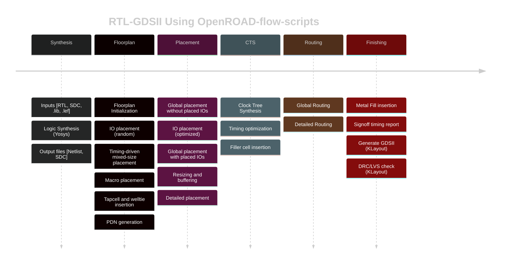

# OpenROAD Flow

[](https://jenkins.openroad.tools/view/Public/job/OpenROAD-flow-scripts-Public/job/public_tests_all/job/master/)
[](https://openroad-flow-scripts.readthedocs.io/en/latest/?badge=latest)

OpenROAD-flow-scripts (ORFS) is a fully autonomous, RTL-GDSII flow
for rapid architecture and design space exploration, early prediction
of QoR and detailed physical design implementation. However, ORFS
also enables manual intervention for finer user control of individual
flow stages through Tcl commands and Python APIs.



## Tool Installation

### Docker Based Installation

To ease dependency installation issues, ORFS uses docker images.
Docker image includes ORFS binaries, applications as well as all
required dependencies. All of the flow tools are encapsulated
inside the container image.

If `Docker` is not installed already, install latest docker tool
based on OS from [here](https://docs.docker.com/engine/install/).

To manage docker as non-root user and verify that you can run
`docker` commands without `sudo` must complete steps from
[here](https://docs.docker.com/engine/install/linux-postinstall/).

#### Build ORFS with Docker

Document for detailed steps on docker based installation found
[here](./docs/user/BuildWithDocker.md).

### Pre-built Binaries

You can download, set up and run ORFS easily with pre-built
binaries, including OpenROAD, Yosys and Klayout. See instructions
[here](./docs/user/BuildWithPrebuilt.md).

> **Thanks** to [Precision Innovations](https://precisioninno.com/) for
> providing and supporting OpenROAD based binaries.

> **Note** Only the latest version of OpenROAD is guaranteed to work with
> the latest version of ORFS.

> **Disclaimer** The versions of OpenROAD, Yosys and Klayout provided by
> other third-party vendors are not guaranteed to work with ORFS.

### Build from sources locally

Document for detailed local build from sources and installation steps found [here](./docs/user/BuildLocally.md).

## Using the Flow

- For details about the OpenROAD and the available features and
  individual flows commands, see the documentation
  [here](https://openroad.readthedocs.io/en/latest/).
- For details about automated flow setup, see ORFS docs
  [here](https://openroad-flow-scripts.readthedocs.io/en/latest/index2.html#getting-started-with-openroad-flow-scripts).
- Flow tutorial to run the complete OpenROAD based flow from
  RTL-GDSII, see the tutorial
  [here](https://openroad-flow-scripts.readthedocs.io/en/latest/tutorials/FlowTutorial.html).
- To watch ORFS flow tutorial videos, check
  [here](https://theopenroadproject.org/video).

## Building from your own git repository

ORFS supports hosting projects in your own git repository
without the need to fork ORFS.

To build from your own git repository:

    cd /home/me/myproject
    make --file=~/OpenROAD-flow-scripts/flow/Makefile DESIGN_CONFIG=somefolder/config.mk ...

## Running a quick smoke-test of ORFS on your own Verilog

You can [run ORFS on your own Verilog files](./flow/designs/asap7/minimal/README.md)
without setting up a project or moving your Verilog files and even learn
a thing or two about floorplan, placement and routing
before you create an .sdc file and a config.mk file.

## Citing this Work

If you use this software in any published work, we would appreciate a citation!
Please use the following references:

```
@article{ajayi2019openroad,
  title={OpenROAD: Toward a Self-Driving, Open-Source Digital Layout Implementation Tool Chain},
  author={Ajayi, T and Blaauw, D and Chan, TB and Cheng, CK and Chhabria, VA and Choo, DK and Coltella, M and Dobre, S and Dreslinski, R and Foga{\c{c}}a, M and others},
  journal={Proc. GOMACTECH},
  pages={1105--1110},
  year={2019}
}
```

A copy of this paper is available
[here](http://people.ece.umn.edu/users/sachin/conf/gomactech19.pdf) (PDF).

```
@inproceedings{ajayi2019toward,
  title={Toward an open-source digital flow: First learnings from the openroad project},
  author={Ajayi, Tutu and Chhabria, Vidya A and Foga{\c{c}}a, Mateus and Hashemi, Soheil and Hosny, Abdelrahman and Kahng, Andrew B and Kim, Minsoo and Lee, Jeongsup and Mallappa, Uday and Neseem, Marina and others},
  booktitle={Proceedings of the 56th Annual Design Automation Conference 2019},
  pages={1--4},
  year={2019}
}
```

A copy of this paper is available
[here](https://vlsicad.ucsd.edu/Publications/Conferences/371/c371.pdf) (PDF).

If you like the tools, please give us a star on our GitHub repos!

## License

The OpenROAD-flow-scripts repository (build and run scripts) has a BSD 3-Clause License.
The flow relies on several tools, platforms and designs that each have their own licenses:

- Find the tool license at: `OpenROAD-flow-scripts/tools/{tool}/` or `OpenROAD-flow-scripts/tools/OpenROAD/src/{tool}/`.
- Find the platform license at: `OpenROAD-flow-scripts/flow/platforms/{platform}/`.
- Find the design license at: `OpenROAD-flow-scripts/flow/designs/src/{design}/`.
