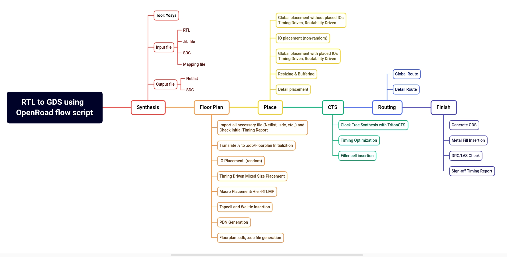

# OpenROAD Flow

[](https://jenkins.openroad.tools/view/Public/job/OpenROAD-flow-scripts-Public/job/public_tests_all/job/master/)
[](https://openroad-flow-scripts.readthedocs.io/en/latest/?badge=latest)

OpenROAD-flow-scripts(ORFS) is a fully autonomous, RTL-GDSII flow
for rapid architecture and design space exploration, early prediction
of QoR and detailed physical design implementation. However,  ORFS
also enables manual intervention for finer user control of individual
flow stages through tcl commands and python APIs.



## Tool Installation

### Local Installation

To install OpenROAD-flow-scripts locally in CentOS 7/8, Ubuntu 
20.04/22.04, RHEL 8, Debian 10/11. Following steps will
clone the ORFS repo, install required dependencies and build the flow.

#### Clone ORFS repo

```
git clone --recursive https://github.com/The-OpenROAD-Project/OpenROAD-flow-scripts
```

#### Install Dependencies

```
cd OpenROAD-flow-scripts
sudo ./setup.sh
```

#### Build the Flow

```
./build_openroad.sh --local
```

Document for detailed local installation steps found [here](./docs/user/BuildLocally.md).

### Docker Based Installation
To ease dependency installation issues, ORFS uses docker images.
Docker image includes ORFS binaries, applications as well as all
required dependencies. All of the flow tools are encapsulated
inside the container image.

If `Docker` is not installed already, refer to the document
[here](./docs/user/DockerInstall.md) on how to install and how to
manage docker as non-root user.

### Build ORFS with Docker

#### Clone ORFS repo

```
git clone --recursive https://github.com/The-OpenROAD-Project/OpenROAD-flow-scripts
```

#### Build the Flow

```
cd OpenROAD-flow-scripts
./build_openroad.sh
```

Document for detailed steps on docker based installation found
[here](./docs/user/BuildWithDocker.md).

### Verify Local Installation
To verify installation run default `gcd/nangate45` design with 
following steps,

```
source env.sh
cd flow
make
```

Above steps run from synthesis to GDSII generation and you can view final layout with OpenROAD GUI as,

```
make gui_final
```


## Using the Flow

- See the OpenROAD [documentation here](https://openroad.readthedocs.io/en/latest/).
- How to [start using OpenROAD flow here](https://openroad-flow-scripts.readthedocs.io/en/latest/user/GettingStarted.html).
- See ORFS [user guide here](https://openroad-flow-scripts.readthedocs.io/en/latest/user/UserGuide.html).
- See ORFS [Flow Tutorial here](https://openroad-flow-scripts.readthedocs.io/en/latest/tutorials/FlowTutorial.html).

## Citing this Work

If you use this software in any published work, we would appreciate a citation!
Please use the following references:

```
@article{ajayi2019openroad,
  title={OpenROAD: Toward a Self-Driving, Open-Source Digital Layout Implementation Tool Chain},
  author={Ajayi, T and Blaauw, D and Chan, TB and Cheng, CK and Chhabria, VA and Choo, DK and Coltella, M and Dobre, S and Dreslinski, R and Foga{\c{c}}a, M and others},
  journal={Proc. GOMACTECH},
  pages={1105--1110},
  year={2019}
}
```

A copy of this paper is available
[here](http://people.ece.umn.edu/users/sachin/conf/gomactech19.pdf) (PDF).

```
@inproceedings{ajayi2019toward,
  title={Toward an open-source digital flow: First learnings from the openroad project},
  author={Ajayi, Tutu and Chhabria, Vidya A and Foga{\c{c}}a, Mateus and Hashemi, Soheil and Hosny, Abdelrahman and Kahng, Andrew B and Kim, Minsoo and Lee, Jeongsup and Mallappa, Uday and Neseem, Marina and others},
  booktitle={Proceedings of the 56th Annual Design Automation Conference 2019},
  pages={1--4},
  year={2019}
}
```

A copy of this paper is available
[here](https://vlsicad.ucsd.edu/Publications/Conferences/371/c371.pdf) (PDF).

If you like the tools, please give us a star on our GitHub repos!

## License

The OpenROAD-flow-scripts repository (build and run scripts) has a BSD 3-Clause License.
The flow relies on several tools, platforms and designs that each have their own licenses:

- Find the tool license at: `OpenROAD-flow-scripts/tools/{tool}/` or `OpenROAD-flow-scripts/tools/OpenROAD/src/{tool}/`.
- Find the platform license at: `OpenROAD-flow-scripts/flow/platforms/{platform}/`.
- Find the design license at: `OpenROAD-flow-scripts/flow/designs/src/{design}/`.
