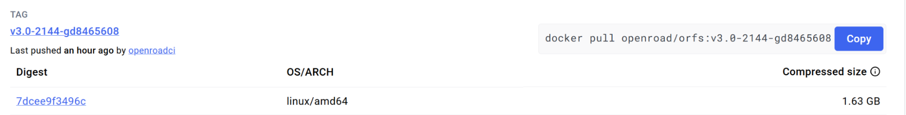
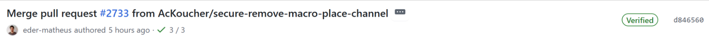

# OpenROAD Docker Software Package Quickstart Guide

# Setup Guide

This setup guide covers machine and software package installation instructions for use with the OpenROAD and OpenROAD Autotuner products. It is intended to be a reference for those setting up a machine to run OpenROAD on.

# Host Machine Requirements

We suggest running a Ubuntu 22.04 or Red Hat Enterprise Linux 8 image with at least 32 CPUs, 128 GB memory, and 500 GB disk.

# Software Packages

The following are software packages that need to be installed to run OpenROAD or OpenROAD Autotuner using docker.

## Docker Installation

We will use Docker to create and run an image that contains everything you need to run the OpenROAD flow. If you already have Docker installed on your cloud machine, you can skip this step.

### Ubuntu Installation

To install Docker:

```
sudo snap install docker  
sudo groupadd docker
```

The docker group needs to be created in order to access the pipe used by docker.

### Red Hat Enterprise Linux Installation

To install Docker:

```
sudo dnf install dnf-plugins-core -y  
sudo dnf config-manager --add-repo https://download.docker.com/linux/rhel/docker-ce.repo
sudo dnf install --allowerasing -y docker-ce docker-ce-cli containerd.io docker-buildx-plugin docker-compose-plugin sudo systemctl start docker
```

The RHEL docker installation automatically adds the docker group to the system, so you can skip the next step.

### Adding the Docker Group to your User

Add the docker group to your user to it, so that you have access to the docker pipe:

```
sudo usermod -aG docker $USER
```

Note that you might either need to log out/log back in or reboot in order for the group change to take effect.

To test that docker is working:

```
docker run hello-world
```

## Podman-Docker Installation
Note: These instructions might only be applicable to RHEL only

Alternatively, you can install podman instead of docker. On RHEL systems, podman might already be installed. To emulate the docker CLI using podman, install the podman-docker package:

```
sudo yum install podman-docker
```

To quiet the docker compatibility message:

```
sudo touch /etc/containers/nodocker
```

## VNC Installation

If you are interested in using the OpenROAD GUI to track the run or view the results, you’ll need to install VNC on the cloud machine. If you have these already installed on the host machine, you can skip this step.

### Ubuntu Installation

To install:

```
sudo apt update  
sudo apt upgrade -y  
sudo apt install tigervnc-standalone-server tigervnc-xorg-extension tigervnc-viewer -y  
sudo apt install xfce4-goodies xfce4 -y
```

Start a vncserver session on the cloud machine and connect the VNC client to it.

### Red Hat Enterprise Linux Installation

To install:

```
sudo dnf update -y  
sudo dnf install tigervnc-server tigervnc-server-module -y  
sudo dnf groupinstall "Server with GUI" -y
```

Start a vncserver session on the cloud machine and connect the VNC client to it.

## XHost Access

In order for the docker container to display the GUI, you must enable docker containers access to the X11 display on the cloud machine. To enable access:

```
xhost +local:docker  
touch /tmp/.docker.xauth
```

## Git Installation
Note: These instructions are applicable to RHEL only

To install git:

```
sudo dnf install git-core -y
```

## Firefox Installation
Note: These instructions are applicable to Ubuntu only

Firefox (or your favorite browser) enables you to view the OpenROAD AutoTuner results via TensorBoard. If you have already installed firefox on the cloud machine, you can skip this step.

To install firefox:

```
sudo snap install firefox
```

## TensorBoard Installation

### Ubuntu Installation

If you want to run TensorBoard on the cloud machine, type the following to install it:

```
sudo apt install python3-pip -y  
sudo pip install tensorboard
```

### Red Hat Enterprise Linux Installation

If you want to run TensorBoard on the cloud machine, type the following to install it:

```
sudo dnf install python3-pip -y  
sudo dnf install redhat-rpm-config -y  
sudo dnf install python3-devel  
sudo dnf groupinstall “Development Tools” -y  
sudo pip3 install tensorboard
```

# Choosing The ORFS Version

The OpenROAD team frequently releases new versions of ORFS and publishes them on [Docker Hub](https://hub.docker.com/r/openroad/orfs/tags)). Based upon your needs, you can choose which version to use in your flow. 

Each version has a listing, which includes the ORFS tag:



In our example above, the tag is v3.0-2144-gd8465608, where 2144 is the build number and gd8465608 is a hash that is related to the corresponding commit tag in the Git OpenROAD-flow-scripts repository.

## Locating the Commit in the OpenROAD-flow-scripts Repository

Locating the commit in the OpenROAD-flow-scripts repository is important in this flow to ensure that the ORFS scripts and the ORFS tools are aligned. It can also be helpful in case you require a specific feature or fix in your flow.

The ORFS Git commit tag version is similar to the Docker Hub tag, but might not be exact. Generally-speaking the Docker Hub tag is the ORFS Git commit tag with a “g” prepended to it and possibly another digit at the end. For the example below, the ORFS Git commit tag is d846560 and the Docker Hub tag is gd8465608.

Please consult the [ORFS git history](https://github.com/The-OpenROAD-Project/OpenROAD-flow-scripts/commits/master/) to find the commit tag that most closely matches the Docker version tag. The commit tag is listed on the right side of each commit (d846560):



# Workspace Creation

We want to store all of our design’s artifacts on the cloud machine’s filesystem, so that all OpenROAD tool invocations can use the same artifacts.

## Clone the ORFS Flow Directory

The easiest way to create the workspace is to clone out the OpenROAD-flow-scripts repository from git onto our host machine and then share it with Docker. In order to ensure that there’s compatibility between the OpenROAD tool and the flow scripts, we’ll want to access the same ORFS version as what we are using in the Docker container defined in the “Locating the Commit in the OpenROAD-flow-scripts Repository” section above (e.g. version d846560)

To clone the repository:

```
git clone --recursive https://github.com/The-OpenROAD-Project/OpenROAD-flow-scripts.git
cd OpenROAD-flow-scripts  
git checkout d846560
```

Note that if we change the version of the ORFS tools we are using, we will also need to run “git pull” followed by a “git checkout” with the corresponding Git commit tag.
