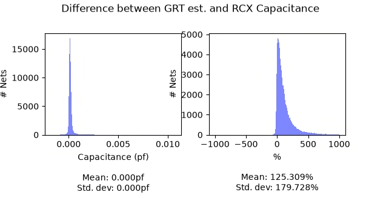

# Correlating RC Values for PDKs

## Background

This tutorial covers how to correlate platform RC values and generate updated RC values for setRC.tcl.

## What’s unit RC?
Unit resistance (resistance per unit length) or unit capacitance (capacitance per unit length) is used to estimate wire delays during place and route flow when fully extracted parasitics are not available. For example, the global router can use unit RC to estimate delays for wires.

Unit RC values can be defined in technology LEF, but many modern PDKs do not specify them. In some cases, the values that are specified are not accurate. 

Inaccurate unit RC values can lead to inconsistent timing results between global route and detailed route.

## Flow usage
Unit RC values per layer can be defined in OpenROAD-flow-scripts/flow/platforms/<PDKname>/setRC.tcl. For example, OpenROAD-flow-scripts/flow/platforms/asap7/setRC.tcl contains

```
set_layer_rc -layer M1 -resistance 7.04175E-02 -capacitance 1e-10
set_layer_rc -layer M2 -resistance 2.97126E-02 -capacitance 1.84542E-01
set_layer_rc -layer M3 -resistance 3.12872E-02 -capacitance 1.53955E-01
set_layer_rc -layer M4 -resistance 1.80365E-02 -capacitance 1.89434E-01
set_layer_rc -layer M5 -resistance 1.89936E-02 -capacitance 1.71593E-01
```

## Generating unit RC values from actual designs

Unit RC values can be extracted by completing P&R flow for relevant designs in ORFS up to detailed route and parasitic extraction. For example, to generate RC values for design ‘ibex’ in PDK asap7, do the following:

```
% cd OpenROAD-flow-scripts/flow
% make DESIGN_CONFIG=./designs/asap7/ibex/config.mk
% make DESIGN_CONFIG=./designs/asap7/ibex/config.mk write_rc
```

This will generate a segment RC CSV file and a net RC CSV file under results
directory. For example, ./results/asap7/ibex/base/6_segments_rc.csv and
./results/asap7/ibex/base/6_nets_rc.csv. The segments data is used to fit the
RC values, while the nets data is used to plot the difference between the
global route estimates and the extracted parasitics.

Note that the CSV files are not regenerated on their own after the design is
run again, so delete them to write the RC data of the new run.

```
% make DESIGN_CONFIG=./designs/asap7/ibex/config.mk correlate_rc
```

This will print a setRC.tcl file content for one design like the following:

```
set_layer_rc -layer M2 -resistance 2.97127E-02 -capacitance 1.74942E-04
set_layer_rc -layer M3 -resistance 3.12870E-02 -capacitance 1.55554E-04
set_layer_rc -layer M4 -resistance 1.80365E-02 -capacitance 1.78475E-04
set_layer_rc -layer M5 -resistance 1.89935E-02 -capacitance 1.64264E-04
set_layer_rc -layer M6 -resistance 1.18796E-02 -capacitance 1.87426E-04
set_layer_rc -layer M7 -resistance 1.25096E-02 -capacitance 1.62979E-04
set_layer_rc -layer M8 -resistance 8.44765E-03 -capacitance 1.03962E-04
set_layer_rc -layer M9 -resistance 8.89556E-03 -capacitance 9.28446E-05

set_wire_rc -resistance 2.63040E-02 -capacitance 1.64745E-04
set_wire_rc -signal -resistance 2.65684E-02 -capacitance 1.65790E-04
set_wire_rc -clock -resistance 2.14161E-02 -capacitance 1.45426E-04
```

Segment RC CSV files from multiple designs can be combined to produce one large segment RC CSV file. This combined CSV file can be used to produce average setRC.tcl that are relevant for two designs by using correlateRC.py utility. For example, to combine RC data from designs ‘ibex’ and ‘jpeg’ together and generate one setRC.tcl, do the following:

```
% make DESIGN_CONFIG=./designs/asap7/ibex/config.mk
% make DESIGN_CONFIG=./designs/asap7/ibex/config.mk write_rc
% make DESIGN_CONFIG=./designs/asap7/jpeg/config.mk
% make DESIGN_CONFIG=./designs/asap7/jpeg/config.mk write_rc
% cat ./results/asap7/ibex/base/6_segments_rc.csv ./results/asap7/jpeg/base/6_segments_rc.csv > combined_segments_rc.csv
% ./util/correlateRC.py -segments_rc_file combined_segments_rc.csv
Reading combined_segments_rc.csv.

Units: resistance [kohm/um], capacitance [pf/um]

Layer        |   Res R² |   Cap R²
----------------------------------
M2           |   1.0000 |   0.9608
M3           |   1.0000 |   0.9632
M4           |   1.0000 |   0.9609
M5           |   1.0000 |   0.9286
M6           |   1.0000 |   0.9471
M7           |   1.0000 |   0.9368
M8           |   1.0000 |   0.8563
M9           |   1.0000 |   0.8304
----------------------------------

set_layer_rc -layer M2 -resistance 2.97127E-02 -capacitance 1.74942E-04
set_layer_rc -layer M3 -resistance 3.12870E-02 -capacitance 1.55554E-04
set_layer_rc -layer M4 -resistance 1.80365E-02 -capacitance 1.78475E-04
set_layer_rc -layer M5 -resistance 1.89935E-02 -capacitance 1.64264E-04
set_layer_rc -layer M6 -resistance 1.18796E-02 -capacitance 1.87426E-04
set_layer_rc -layer M7 -resistance 1.25096E-02 -capacitance 1.62979E-04
set_layer_rc -layer M8 -resistance 8.44765E-03 -capacitance 1.03962E-04
set_layer_rc -layer M9 -resistance 8.89556E-03 -capacitance 9.28446E-05

set_wire_rc -resistance 2.63040E-02 -capacitance 1.64745E-04
set_wire_rc -signal -resistance 2.65684E-02 -capacitance 1.65790E-04
set_wire_rc -clock -resistance 2.14161E-02 -capacitance 1.45426E-04
```

## Generating correlation plots
correlateRC.py has an option to generate capacitance and resistance correlation plots between global route and detail route where RC extraction is performed.

For example, to plot capacitance correlation results for two designs ‘ibex’ and ‘jpeg’ from the above example, use -plot_cap option. For resistance correlation use -plot_res option.

Note that both the combined nets and segments files are required to generate the plot.

```
% cat ./results/asap7/ibex/base/6_nets_rc.csv ./results/asap7/jpeg/base/6_nets_rc.csv > combined_nets_rc.csv
% ./util/correlateRC.py -plot_cap -nets_rc_file ./combined_net_rc.csv -segments_rc_file ./combined_segment_rc.csv
```


