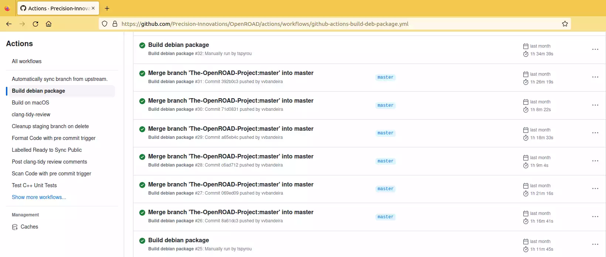

# Build from sources locally

## Clone and Install Dependencies

The `setup.sh` script installs all of the dependencies, including OpenROAD dependencies, if they are not already installed.

Supported configurations are: CentOS 7, Ubuntu 20.04, Ubuntu 22.04, RHEL 8,
Debian 10 and Debian 11.

``` shell
git clone --recursive https://github.com/The-OpenROAD-Project/OpenROAD-flow-scripts
cd OpenROAD-flow-scripts
sudo ./setup.sh
```

## Build

``` shell
./build_openroad.sh --local
```
> **Note:** There is a `build_openroad.log` file that is generated with every build in the main directory. In case of filing issues, it can be uploaded in the "Relevant log output" section of OpenROAD-flow-scripts repo [issue form](https://github.com/The-OpenROAD-Project/OpenROAD-flow-scripts/issues/new?assignees=&labels=&template=bug_report_with_orfs.yml).

## Verify Installation

The binaries should be available on your `$PATH` after setting
up the environment.

``` shell
source ./env.sh
yosys -help
openroad -help
cd flow
make
```

Above `make` command run from RTL-GDSII generation for default
design `gcd` with `nangate45` pdk. You can view final layout with
OpenROAD GUI as,

```
make gui_final
```


## Using Pre-built Binaries

You can download pre-built binaries with self contained dependencies
included from the Precision Innovations github repository
[here](https://github.com/Precision-Innovations/OpenROAD/actions/workflows/github-actions-build-deb-package.yml).

The following platform are supported currently:
- Ubuntu 20.04/22.04
- Debian 10/11

Use following steps to download:

Step 1: Click on the [link](https://github.com/Precision-Innovations/OpenROAD/actions/workflows/github-actions-build-deb-package.yml)

Step 2: Select the latest build with a green check `Build debian package`



Step 3: At the bottom of the page download the artifacts for your
        distribution.


Step 4: Extract the files and based on platform use package installer.
        For example Ubuntu platform use
```
sudo dpkg -i openroad_2.0_amd64-ubuntu20.04.deb
```

You can install these binaries within docker as well.

## Compiling and debugging in Visual Studio Code

Set up environment variables to point to tools that CMake from within
Visual Studio Code will need, then start Visual Studio Code as usual
and hit F7, assuming you have CMake plugins installed.

``` shell
. ./dev_env.sh
code tools/OpenROAD/
```
