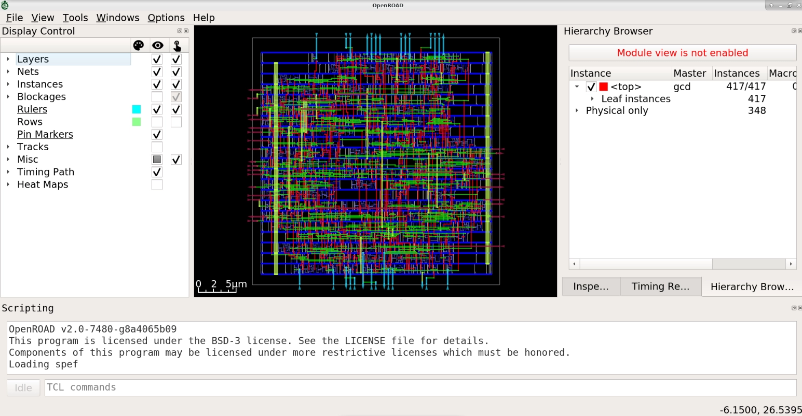

# Build from sources locally

## Clone and Install Dependencies

The `setup.sh` script installs all of the dependencies, including OpenROAD dependencies, if they are not already installed.

Supported configurations are: Ubuntu 20.04, Ubuntu 22.04, Ubuntu 22.04(aarch64), RHEL 8, RockyLinux 9 and Debian 11.

``` shell
git clone --recursive https://github.com/The-OpenROAD-Project/OpenROAD-flow-scripts
cd OpenROAD-flow-scripts
sudo ./setup.sh
```

## Using Bazel to build OpenROAD and run the ORFS flow

Long story short: OpenROAD will eventually switch to using Bazel for downloading dependencies and building OpenROAD for all the reasons that the DependencyInstaller.sh and cmake are hard to support and brittle across platforms.

Currently the simplest way to build OpenROAD and run ORFS is to run one test, which will download all OpenROAD dependencies and build OpenROAD in the exec configuration:

``` shell
cd tools/OpenROAD
bazelisk test src/drt/...
cd ../../flow
make OPENROAD_EXE=$(pwd)/../tools/OpenROAD/bazel-out/k8-opt-exec-ST-*/bin/openroad
```

Bazel could similarly be used to download and make available pre-built binaries for tools such as Yosys, eqy and KLayout.

Running some quick tests will cause the desired exec config of OpenROAD to be built. There's no explicit Bazel way to build an exec config of an executable and we want to to use an exec config that is the same binary as is used for a local OpenROAD modify + test Bazel cycle.

## Build

``` shell
./build_openroad.sh --local
```
:::{Note}
There is a `build_openroad.log` file that is generated with every
build in the main directory. In case of filing issues, it can be uploaded
in the "Relevant log output" section of OpenROAD-flow-scripts repo
[issue form](https://github.com/The-OpenROAD-Project/OpenROAD-flow-scripts/issues/new?assignees=&labels=&template=bug_report_with_orfs.yml).
:::

## Verify Installation

The binaries should be available on your `$PATH` after setting
up the environment. The `make` command runs from RTL-GDSII generation for default design `gcd` with `nangate45` PDK. 

``` shell
source ./env.sh
yosys -help
yosys -m slang -p "slang_version"
openroad -help
cd flow
make
```

You can view final layout images in OpenROAD GUI using this command.

``` shell
make gui_final
```



## Compiling and debugging in Visual Studio Code

Set up environment variables using `dev_env.sh`, then start Visual Studio Code. Please ensure [CMake plugins](https://code.visualstudio.com/docs/cpp/cmake-linux) are installed.

``` shell
. ./dev_env.sh
code tools/OpenROAD/
```

## Build OpenROAD and run a few ORFS flows with Bazel

Local use case:

- Install Bazelisk and no other dependencies, no need to run `sudo ./setup.sh`
- Modify & build OpenROAD
- Test built OpenROAD with a few ORFS flows

The Bazel support in OpenROAD and ORFS is work in progress and some Bazel experience is recommended before going spelunking in the Bazel builds.

Contributions welcome!

To build `designs/asap7/gcd:gcd_floorplan`:

    cd flow
    (cd ../tools/OpenROAD && bazel build :openroad -c opt) && bazelisk build designs/asap7/gcd:gcd_floorplan

Or to run all flows currently available in Bazel

    cd flow
    (cd ../tools/OpenROAD && bazel build :openroad -c opt) && bazelisk build ...

Note! ORFS uses the OpenROAD Bazel built binary in stop-gap way until OpenROAD has been switched to bzlmod, after which to build all flows becomes simpler as ORFS will build the requisite OpenROAD directly:

    cd flow
    bazelisk build ...

ORFS uses [bazel-orfs](https://github.com/The-OpenROAD-Project/bazel-orfs) to implement the flow and gets some depedencies, like yosys, from the Docker image. Over time, all dependencies should be built with Bazel and the dependency on the ORFS Docker image will be phased out.

### Upgrading MODULE.bazel with the latest bazel-orfs and ORFS Docker image

Run:

    bazelisk run @bazel-orfs//:bump

Then commit MODULE.bazel and MODULE.bazel.lock.
