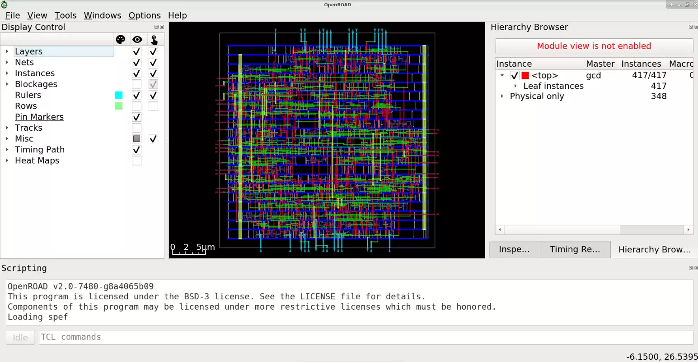

# Build from sources locally

## Clone and Install Dependencies

The `setup.sh` script installs all of the dependencies, including OpenROAD dependencies, if they are not already installed.

Supported configurations are: CentOS 7, Ubuntu 20.04, Ubuntu 22.04, Ubuntu 22.04(aarch64), RHEL 8,
Debian 10 and Debian 11.

``` shell
git clone --recursive https://github.com/The-OpenROAD-Project/OpenROAD-flow-scripts
cd OpenROAD-flow-scripts
sudo ./setup.sh
```

## Build

``` shell
./build_openroad.sh --local
```
:::{Note}
There is a `build_openroad.log` file that is generated with every
build in the main directory. In case of filing issues, it can be uploaded
in the "Relevant log output" section of OpenROAD-flow-scripts repo
[issue form](https://github.com/The-OpenROAD-Project/OpenROAD-flow-scripts/issues/new?assignees=&labels=&template=bug_report_with_orfs.yml).
:::

## Verify Installation

The binaries should be available on your `$PATH` after setting
up the environment. The `make` command runs from RTL-GDSII generation for default design `gcd` with `nangate45` PDK. 

``` shell
source ./env.sh
yosys -help
openroad -help
cd flow
make
```

You can view final layout images in OpenROAD GUI using this command.

``` shell
make gui_final
```



## Compiling and debugging in Visual Studio Code

Set up environment variables using `dev_env.sh`, then start Visual Studio Code. Please ensure [CMake plugins](https://code.visualstudio.com/docs/cpp/cmake-linux) are installed.

``` shell
. ./dev_env.sh
code tools/OpenROAD/
```
