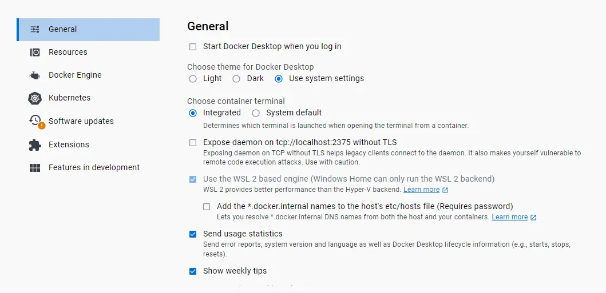
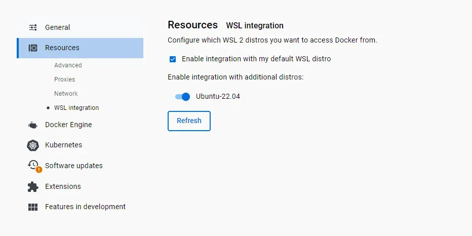

# Build with WSL
Windows Subsystem for Linux, or WSL for short is a way for you to mount a Linux-based OS onto your Windows machine, allowing you to build OpenROAD-flow-scripts both locally and via Docker. 

## Install WSL
Instructions to install WSL can be found [here](https://learn.microsoft.com/en-us/windows/wsl/install). You may use any kernel supported, such as: Ubuntu 20.04, Ubuntu 22.04, RHEL 8, RockyLinux 9, Debian 11.

We recommend that users follow the Docker build by continuing onto the guide below. However, if you wish to install locally, you may follow the build locally instructions [here](./BuildLocally.md).

> **TIP**: You may delete your WSL kernel using this [guide](https://pureinfotech.com/remove-linux-distro-wsl/).


## Docker configuration
This section assumes you have set up Docker for Windows already. If not, please refer to the Docker official website for instructions [here](https://docs.docker.com/desktop/install/windows-install/).

You need to enable the following options to allow WSL to use Docker. 

General > Use the WSL 2 Based engine (should be default selection)


Resources > WSL integration > Enable integration with my default WSL distro and select "Ubuntu-22.04", or the distribution you installed.  


## Accessing WSL
You may access WSL from the app named "Ubuntu 22.04 LTS". Run the following:
```
sudo apt-get update; sudo apt-get upgrade; sudo apt install -y build-essential python3 python3-venv python3-pip make
```
Verify if Docker is running
```
docker run hello-world
```
You should see:

```
Hello from Docker!
This message shows that your installation appears to be working correctly.
```

If everything is successful up to this point, congratulations! You are now ready to follow the [Docker guide](./BuildWithDocker.md) as you have configured a Linux system with necessary dependencies. 
