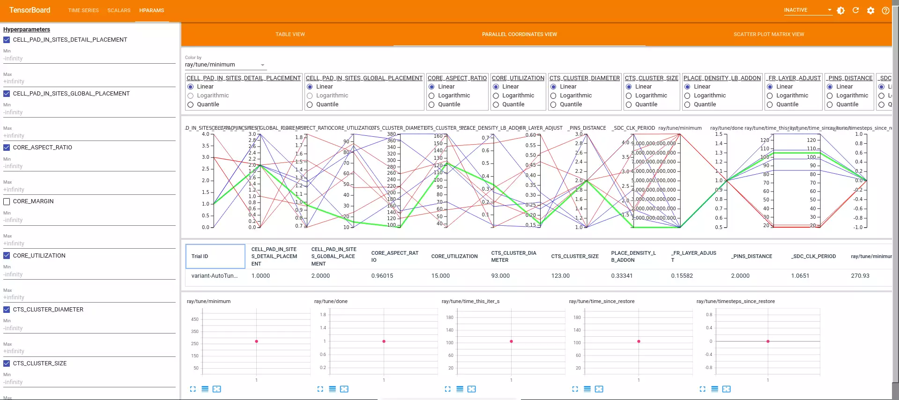

# Instructions for AutoTuner with Ray

_AutoTuner_ is a "no-human-in-loop" parameter tuning framework for commercial and academic RTL-to-GDS flows.
AutoTuner provides a generic interface where users can define parameter configuration as JSON objects.
This enables AutoTuner to easily support various tools and flows. AutoTuner also utilizes [METRICS2.1](https://github.com/ieee-ceda-datc/datc-rdf-Metrics4ML) to capture PPA
of individual search trials. With the abundant features of METRICS2.1, users can explore various reward functions that steer the flow autotuning to different PPA goals.

AutoTuner provides two main functionalities as follows.
* Automatic hyperparameter tuning framework for OpenROAD-flow-script (ORFS)
* Parametric sweeping experiments for ORFS


AutoTuner contains top-level Python script for ORFS, each of which implements a different search algorithm. Current supported search algorithms are as follows.
* Random/Grid Search
* Population Based Training ([PBT](https://www.deepmind.com/blog/population-based-training-of-neural-networks))
* Tree Parzen Estimator ([HyperOpt](https://hyperopt.github.io/hyperopt))
* Bayesian + Multi-Armed Bandit ([AxSearch](https://ax.dev/))
* Tree Parzen Estimator + Covariance Matrix Adaptation Evolution Strategy ([Optuna](https://optuna.org/))
* Evolutionary Algorithm ([Nevergrad](https://github.com/facebookresearch/nevergrad))

User-defined coefficient values (`coeff_perform`, `coeff_power`, `coeff_area`) of three objectives to set the direction of tuning are written in the script. Each coefficient is expressed as a global variable at the `get_ppa` function in `PPAImprov` class in the script (`coeff_perform`, `coeff_power`, `coeff_area`). Efforts to optimize each of the objectives are proportional to the specified coefficients.


## Setting up AutoTuner

We have provided two convenience scripts, `./install.sh` and `./setup.sh`
that works in Python3.8 for installation and configuration of AutoTuner,
as shown below:

```{note}
Make sure you run the following commands in `./tools/AutoTuner/src/autotuner`.
```

```shell
# Install prerequisites
./tools/AutoTuner/install.sh

# Start virtual environment
./tools/AutoTuner/setup.sh
```

## Input JSON structure

Sample JSON [file](https://github.com/The-OpenROAD-Project/OpenROAD-flow-scripts/blob/master/flow/designs/sky130hd/aes/autotuner.json) for Sky130HD `aes` design:  

Alternatively, here is a minimal example to get started:

```json
{
    "_SDC_FILE_PATH": "constraint.sdc",
    "_SDC_CLK_PERIOD": {
        "type": "float",
        "minmax": [
            1.0,
            3.7439
        ],
        "step": 0
    },
    "CORE_MARGIN": {
        "type": "int",
        "minmax": [
            2,
            2
        ],
        "step": 0
    },
}
```

* `"_SDC_FILE_PATH"`, `"_SDC_CLK_PERIOD"`, `"CORE_MARGIN"`: Parameter names for sweeping/tuning.
* `"type"`: Parameter type ("float" or "int") for sweeping/tuning
* `"minmax"`: Min-to-max range for sweeping/tuning. The unit follows the default value of each technology std cell library.
* `"step"`: Parameter step within the minmax range. Step 0 for type "float" means continuous step for sweeping/tuning. Step 0 for type "int" means the constant parameter.

## Tunable / sweepable parameters

Tables of parameters that can be swept/tuned in technology platforms supported by ORFS.
Any variable that can be set from the command line can be used for tune or sweep.

For SDC you can use:

* `_SDC_FILE_PATH`
  - Path relative to the current JSON file to the SDC file.
* `_SDC_CLK_PERIOD`
  - Design clock period. This will create a copy of `_SDC_FILE_PATH` and modify the clock period.
* `_SDC_UNCERTAINTY`
  - Clock uncertainty. This will create a copy of `_SDC_FILE_PATH` and modify the clock uncertainty.
* `_SDC_IO_DELAY`
  - I/O delay. This will create a copy of `_SDC_FILE_PATH` and modify the I/O delay.


For Global Routing parameters that are set on `fastroute.tcl` you can use:

* `_FR_FILE_PATH`
  - Path relative to the current JSON file to the `fastroute.tcl` file.
* `_FR_LAYER_ADJUST`
  - Layer adjustment. This will create a copy of `_FR_FILE_PATH` and modify the layer adjustment for all routable layers, i.e., from `$MIN_ROUTING_LAYER` to `$MAX_ROUTING_LAYER`.
* `_FR_LAYER_ADJUST_NAME`
  - Layer adjustment for layer NAME. This will create a copy of `_FR_FILE_PATH` and modify the layer adjustment only for the layer NAME.
* `_FR_GR_SEED`
  - Global route random seed. This will create a copy of `_FR_FILE_PATH` and modify the global route random seed.

## How to use

### General Information

The `distributed.py` script uses Ray's job scheduling and management to
fully utilize available hardware resources from a single server 
configuration, on-premies or over the cloud with multiple CPUs. 
The two modes of operation: `sweep`, where every possible parameter
combination in the search space is tested; and `tune`, where we use
Ray's Tune feature to intelligently search the space and optimize
hyperparameters using one of the algorithms listed above. The `sweep`
mode is useful when we want to isolate or test a single or very few
parameters. On the other hand, `tune` is more suitable for finding
the best combination of a complex and large number of flow 
parameters. Both modes rely on user-specified search space that is 
defined by a `.json` file, they use the same syntax and format, 
though some features may not be available for sweeping.

```{note}
The order of the parameters matter. Arguments `--design`, `--platform` and
`--config` are always required and should precede <mode>.
```

#### Tune only 

* AutoTuner: `python3 distributed.py tune -h`

Example:

```shell
python3 distributed.py --design gcd --platform sky130hd \
                       --config ../../../../flow/designs/sky130hd/gcd/autotuner.json \
                       tune --samples 5
```
#### Sweep only 

* Parameter sweeping: `python3 distributed.py sweep -h`

Example:

```shell
python3 distributed.py --design gcd --platform sky130hd \
                       --config distributed-sweep-example.json \
                       sweep
```


### Google Cloud Platform (GCP) distribution with Ray

GCP Setup Tutorial coming soon.


### List of input arguments
| Argument                      | Description                                                                                           |
|-------------------------------|-------------------------------------------------------------------------------------------------------|
| `--design`                    | Name of the design for Autotuning.                                                                    |
| `--platform`                  | Name of the platform for Autotuning.                                                                  |
| `--config`                    | Configuration file that sets which knobs to use for Autotuning.                                       |
| `--experiment`                | Experiment name. This parameter is used to prefix the FLOW_VARIANT and to set the Ray log destination.|
| `--resume`                    | Resume previous run.                                                                                  |
| `--git_clean`                 | Clean binaries and build files. **WARNING**: may lose previous data.                                  |
| `--git_clone`                 | Force new git clone. **WARNING**: may lose previous data.                                             |
| `--git_clone_args`            | Additional git clone arguments.                                                                       |
| `--git_latest`                | Use latest version of OpenROAD app.                                                                   |
| `--git_or_branch`             | OpenROAD app branch to use.                                                                           |
| `--git_orfs_branch`           | OpenROAD-flow-scripts branch to use.                                                                  |
| `--git_url`                   | OpenROAD-flow-scripts repo URL to use.                                                                |
| `--build_args`                | Additional arguments given to ./build_openroad.sh                                                     |
| `--algorithm`                 | Search algorithm to use for Autotuning.                                                               |
| `--eval`                      | Evalaute function to use with search algorithm.  \                                                    |
| `--samples`                   | Number of samples for tuning.                                                                         |
| `--iterations`                | Number of iterations for tuning.                                                                      |
| `--resources_per_trial`       | Number of CPUs to request for each tuning job.                                                        |
| `--reference`                 | Reference file for use with PPAImprov.                                                                |
| `--perturbation`              | Perturbation interval for PopulationBasedTraining                                                     |
| `--seed`                      | Random seed.                                                                                          |
| `--jobs`                      | Max number of concurrent jobs.                                                                        |
| `--openroad_threads`          | Max number of threads usable.                                                                         |
| `--server`                    | The address of Ray server to connect.                                                                 |
| `--port`                      | The port of Ray server to connect.                                                                    |
| `-v` or `--verbose`           | Verbosity Level. [0: Only ray status, 1: print stderr, 2: print stdout on top of what is in level 0 and 1. ]                  |
|                               |                                                                                                       |
### GUI

Basically, progress is displayed at the terminal where you run, and when all runs are finished, the results are displayed.
You could find the "Best config found" on the screen.

To use TensorBoard GUI, run `tensorboard --logdir=./<logpath>`. While TensorBoard is running, you can open the webpage `http://localhost:6006/` to see the GUI.

We show three different views possible at the end, namely: `Table View`, `Scatter Plot Matrix View` and `Parallel Coordinate View`.


<p style="text-align: center;">Table View</p>


<p style="text-align: center;">Scatter Plot Matrix View</p>


<p style="text-align: center;">Parallel Coordinate View (best run is in green)</p>

## Testing framework

Assuming the virtual environment is setup at `./tools/AutoTuner/autotuner_env`:

```
./tools/AutoTuner/setup.sh
python3 ./tools/AutoTuner/test/smoke_test_sweep.py
python3 ./tools/AutoTuner/test/smoke_test_tune.py
```

## Citation

Please cite the following paper.

* J. Jung, A. B. Kahng, S. Kim and R. Varadarajan, "METRICS2.1 and Flow Tuning in the IEEE CEDA Robust Design Flow and OpenROAD", [(.pdf)](https://vlsicad.ucsd.edu/Publications/Conferences/388/c388.pdf), [(.pptx)](https://vlsicad.ucsd.edu/Publications/Conferences/388/c388.pptx), [(.mp4)](https://vlsicad.ucsd.edu/Publications/Conferences/388/c388.mp4), Proc. ACM/IEEE International Conference on Computer-Aided Design, 2021.

## Acknowledgments

AutoTuner has been developed by UCSD with the OpenROAD Project.
