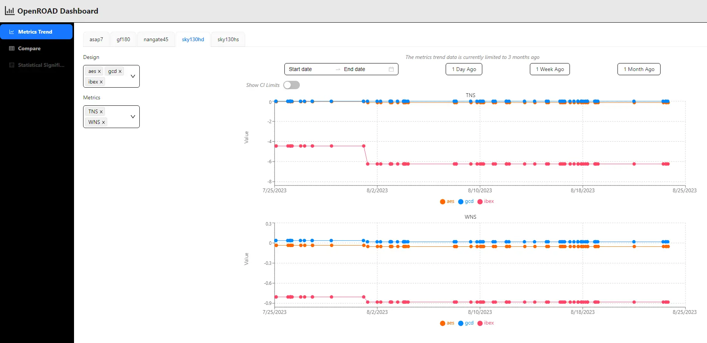

# Using the OpenROAD Dashboard to track and analyze Quality of Results

The metrics dashboard [(https://dashboard.theopenroadproject.org/)](https://dashboard.theopenroadproject.org/)
is tailored for RTL-to-GDS flow stages, targeting different designs across
various platforms. The dashboard comprises two main pages: the trends
page and the comparison page.

## Trends

The trends page allows users to visualize metric trends through 
interactive graphs, enabling the selection of platforms, designs, 
and metrics for each platform. This feature aids in tracking the 
fluctuations of metrics over time.

## Comparison 

The comparison page lets users compare metrics between branches 
or commits for a specific platform and its designs. The comparison is 
shown as a table showcasing the differences between the 
base source and the test source. This page also offers deeper insights, 
like the platform summary table that presents statistical trends for 
different designs within a platform and a summary table that 
provides insights for the set of selected designs, with added 
functionality for filtering.

These pages combine to create a comprehensive dashboard facilitating 
data-driven decision-making and performance optimization in the 
design flow.
