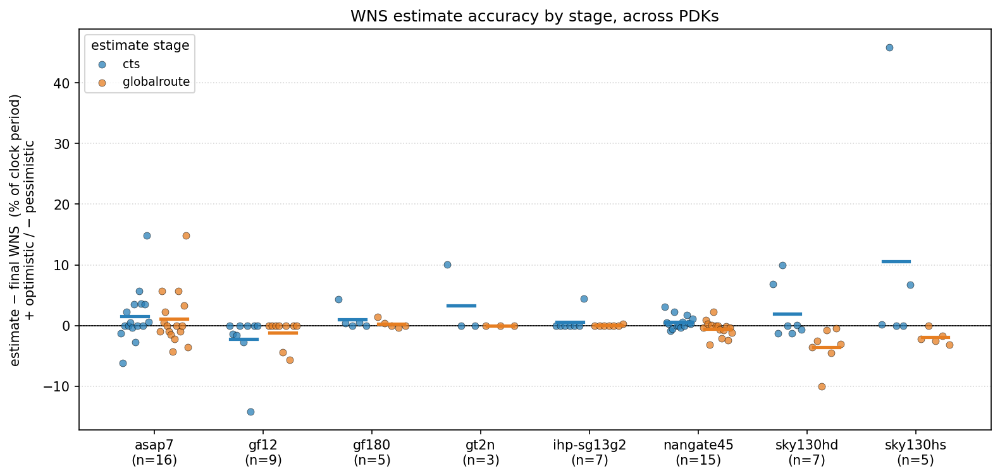

# ORFS designs

## Findings: how accurate are early-stage WNS estimates?

Reading the committed `rules-base.json` baselines, normalized by each design's clock
period (parsed from its `.sdc`), the picture across the 67 designs / 8 PDKs that expose
`cts` and `globalroute` slack is:

- **Global route usually tightens the estimate.** For most PDKs the mean absolute error
  drops from `cts` to `globalroute` — dramatically for `sky130hs` (10.5% → 1.9%) and
  `gt2n` (3.3% → 0.0%), and clearly for `gf12` (2.2% → 1.1%) and `ihp-sg13g2`
  (0.6% → 0.0%). `ihp-sg13g2` and `gf180` are already accurate at `cts`.

- **`cts` is biased optimistic; `globalroute` often overshoots into pessimism.** Every
  PDK's `cts` bias is ≥ 0 (cts reports more slack than the design finally closes with),
  whereas `globalroute` bias flips negative for `sky130hd` (−3.5%), `sky130hs` (−1.9%),
  `gf12` (−1.1%) and `nangate45` (−0.5%). Global route tends to *over-correct*.

- **`sky130hd` is the exception where routing makes the estimate worse**, not better:
  `globalroute` MAE (3.5%) exceeds `cts` MAE (2.9%), and it is consistently pessimistic.

- **Outliers are design-specific, not PDK-wide.** `sky130hs/gcd` has `cts` +45.9%
  (wildly optimistic, fully corrected by `globalroute`), and `asap7/swerv_wrapper` is
  +14.9% optimistic at *both* stages — the cases most likely to mislead an early-stage
  go/no-go decision.

Practical reading: `cts` slack is a usable optimistic rank-ordering; `globalroute` is the
first estimate within a few % of final for most PDKs, but on `sky130hd` (and for specific
designs elsewhere) even `globalroute` can be off by 3–10% of the clock period. This is the
design-level companion to the per-net GRT-vs-RCX divergence in
[`flow/docs/rcx`](../docs/rcx/README.md) (PR #4302). Per-PDK design breakdowns:
[asap7](asap7/README.md), [nangate45](nangate45/README.md), [sky130hd](sky130hd/README.md),
[sky130hs](sky130hs/README.md), [gf12](gf12/README.md), [gf180](gf180/README.md),
[gt2n](gt2n/README.md), [ihp-sg13g2](ihp-sg13g2/README.md).

<!-- BEGIN WNS-ACCURACY (generated by flow/util/plot_wns.py) -->
## WNS estimate accuracy across PDKs

How closely the earlier-stage worst-slack estimates (`cts`, `globalroute`) match the final (`finish`) WNS, per design, normalized by that design's clock period so PDKs with different timing units are comparable. Error is `(stage − finish) / clock_period`; **positive = optimistic** (the stage reported more slack than the design actually closes with), negative = pessimistic. Clock period is parsed from each design's `.sdc`; designs whose period could not be parsed are omitted.

Mean absolute error (MAE) and mean signed error (bias), in % of clock period:

| PDK | designs | cts MAE | cts bias | grt MAE | grt bias | worst (design) |
| --- | ---: | ---: | ---: | ---: | ---: | --- |
| asap7 | 16 | 2.8% | +1.5% | 2.9% | +1.1% | +14.9% (swerv_wrapper globalroute) |
| gf12 | 9 | 2.2% | -2.2% | 1.1% | -1.1% | -14.2% (jpeg cts) |
| gf180 | 5 | 1.0% | +1.0% | 0.4% | +0.3% | +4.3% (aes cts) |
| gt2n | 3 | 3.3% | +3.3% | 0.0% | +0.0% | +10.0% (aes cts) |
| ihp-sg13g2 | 7 | 0.6% | +0.6% | 0.0% | +0.0% | +4.5% (spi cts) |
| nangate45 | 15 | 0.8% | +0.6% | 1.0% | -0.5% | -3.2% (black_parrot globalroute) |
| sky130hd | 7 | 2.9% | +2.0% | 3.5% | -3.5% | -10.0% (gcd globalroute) |
| sky130hs | 5 | 10.5% | +10.5% | 1.9% | -1.9% | +45.9% (gcd cts) |

_Generated by `flow/util/plot_wns.py`; regenerate with `python3 flow/util/plot_wns.py`._
<!-- END WNS-ACCURACY -->
