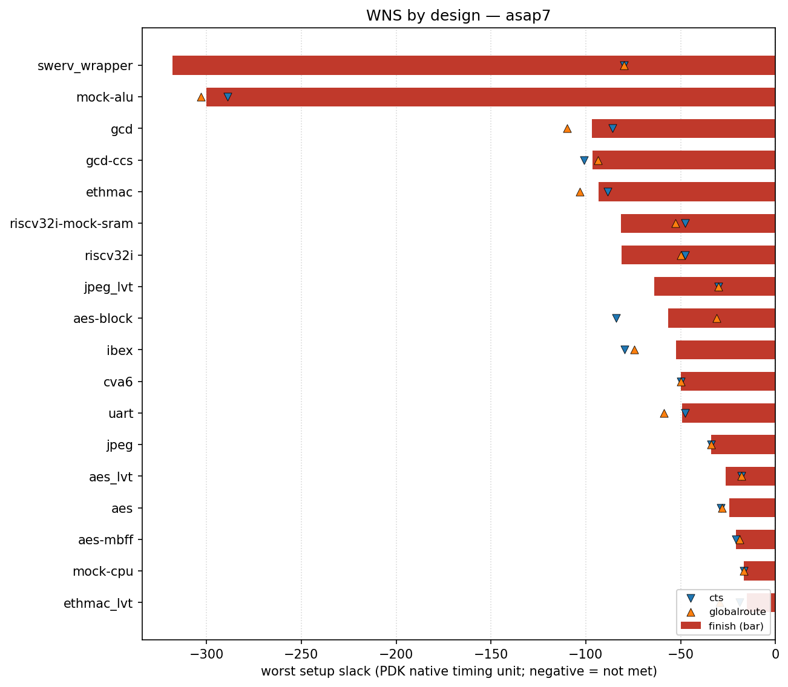

# asap7 designs

## Findings: worst negative slack (WNS) across asap7

These notes read the committed `rules-base.json` baselines — the worst setup slack each
design reaches at clock-tree synthesis (`cts`), global route (`globalroute`) and `finish`.
The plot and table below are regenerated from that data by
[`flow/util/plot_wns.py`](../../util/plot_wns.py); no flow run is needed, so the numbers
are exactly what CI checks against.

What stands out:

- **Every asap7 design closes with negative setup slack.** All 18 baselines have
  `finish` WNS < 0, so the committed asap7 constraints target clocks the flow does not
  actually meet — these baselines track *how far short* each design lands, not timing
  closure. `swerv_wrapper` (≈ −318) and `mock-alu` (≈ −300) are the extreme cases, an
  order of magnitude worse than the cluster around −15 … −50 (`aes*`, `mock-cpu`,
  `uart`, `jpeg`).

- **Worst slack is often not stable across stages.** Some designs pin their critical
  path early and barely move (`cva6`, `jpeg`, `mock-cpu`: `cts ≈ globalroute ≈ finish`).
  Others move a lot: `swerv_wrapper` degrades from −80 at cts/globalroute to −318 at
  finish, and `riscv32i`/`riscv32i-mock-sram` slip from ≈ −47 (cts) to ≈ −81 (finish) —
  routing and final extraction make the path materially worse than CTS predicted.

- **Global route is sometimes more pessimistic than finish.** For `gcd`
  (cts −85.9 → globalroute −110 → finish −96.7) and `aes-block`
  (cts −84 → globalroute −31 → finish −57) the worst-slack estimate swings between
  stages rather than monotonically worsening. This is the same GRT-vs-post-route
  estimate gap explored in [`flow/docs/rcx`](../../docs/rcx/README.md) (PR #4302), here
  visible at the design level rather than per net.

The takeaway for anyone using cts-stage slack as a proxy for the final result: for asap7
it is a usable rank ordering but not a reliable magnitude — several designs move tens of
units (and `swerv_wrapper` hundreds) between cts and finish.

<!-- BEGIN WNS (generated by flow/util/plot_wns.py) -->
## WNS

Worst setup slack per design at three flow stages — clock-tree synthesis (`cts`), global route (`globalroute`) and `finish` — read from each design's `rules-base.json`. Negative means setup timing is not met. Values are in this PDK's native timing unit (ps for `asap7`, ns for most others), so they are comparable within this PDK but not across PDKs.

The bar is the `finish` slack; the markers show the `cts` and `globalroute` slack for the same design, so stage-to-stage movement is visible.

| design | cts | globalroute | finish |
| --- | ---: | ---: | ---: |
| swerv_wrapper | -80 | -80 | -318 |
| mock-alu | -289 | -303 | -300 |
| gcd | -85.9 | -110 | -96.7 |
| gcd-ccs | -101 | -93.7 | -96.4 |
| ethmac | -88.6 | -103 | -93.3 |
| riscv32i-mock-sram | -47.5 | -52.8 | -81.3 |
| riscv32i | -47.5 | -49.8 | -81.2 |
| jpeg_lvt | -30 | -30 | -63.9 |
| aes-block | -84.1 | -31.1 | -56.6 |
| ibex | -79.4 | -74.3 | -52.5 |
| cva6 | -50 | -50 | -50 |
| uart | -47.6 | -58.7 | -49.1 |
| jpeg | -34 | -34 | -34 |
| aes_lvt | -18 | -18 | -26.1 |
| aes | -28.9 | -28 | -24.2 |
| aes-mbff | -20.8 | -19 | -20.8 |
| mock-cpu | -16.6 | -16.6 | -16.6 |
| ethmac_lvt | -19 | -29.5 | -15.2 |

_Generated by `flow/util/plot_wns.py` from `rules-base.json`; regenerate with `python3 flow/util/plot_wns.py`._
<!-- END WNS -->
