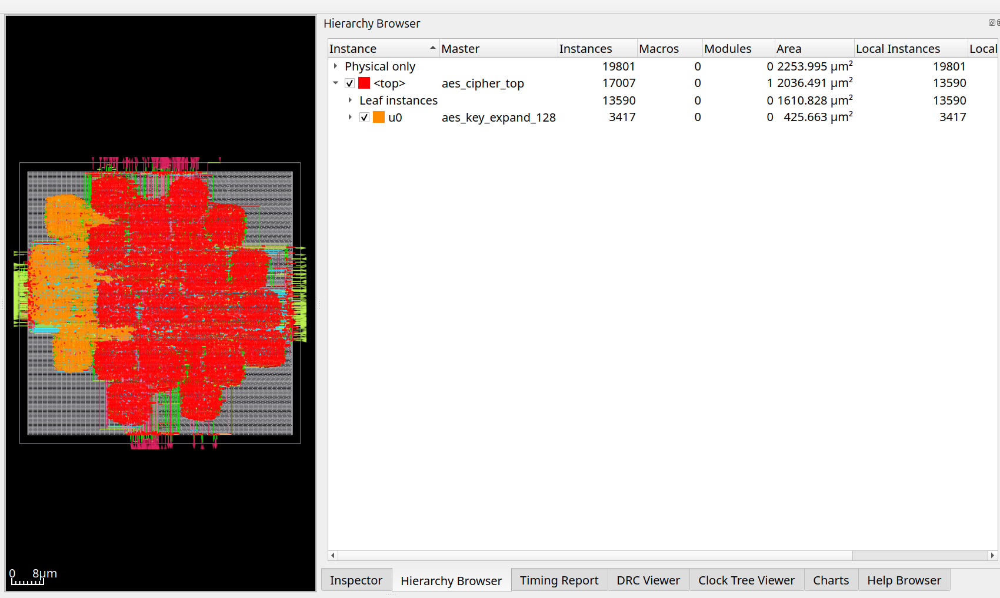

# Parallel synthesis with SYNTH_BLACKBOXES

For large designs, it can be useful to split synthesis for the
major blocks and combine the synthesized result.

SYNTH_HIERARCHICAL=1 and SYNTH_MINIMUM_KEEP_SIZE can be used to adjust which
modules are flattened and which are kept.

A module that is not flattened, can be built separately without any
loss in quality of results and combined as shown below. The module
that is built separately be built with and without SYNTH_HIERARCHICAL=1.

1. Synthesize aes_key_expand_128 module

       make DESIGN_CONFIG=designs/asap7/aes/config.mk FLOW_VARIANT=blackbox clean_synth synth
2. Synthesize top module, which could happen in parallel to 1 but with aes_key_expand_128 blacklisted:

       make DESIGN_CONFIG=designs/asap7/aes/config.mk FLOW_VARIANT=top clean_synth synth
3. Combine the synthesis results above:

       make DESIGN_CONFIG=designs/asap7/aes/config.mk FLOW_VARIANT=combine clean_synth synth

4. View final result:

       make DESIGN_CONFIG=designs/asap7/aes/config.mk FLOW_VARIANT=combine
       make DESIGN_CONFIG=designs/asap7/aes/config.mk FLOW_VARIANT=combine gui_final

