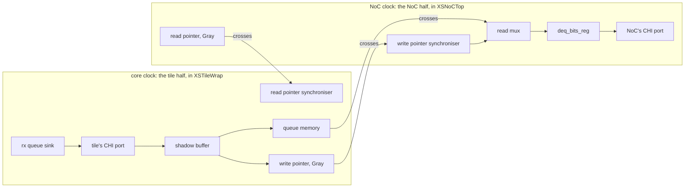

# chi_async_bridge

The asynchronous bridge that carries XiangShan's CHI link between the
core's clock and the network-on-chip's. Six flit channels, each an
asynchronous queue, cross from one clock domain to the other, with their
link credits and handshakes. Both halves of the bridge are in this one
block, so timing analysis sees both ends of every crossing.

The design exists to measure one thing: whether the flow implements an
asynchronous crossing the way its constraints describe it. Every path
from one clock to the other meets its budget, nothing tries to fix hold
across the asynchronous boundary, each synchroniser's flops stay
together, and what is left to fail is the logic inside each domain.

## What it tests that no other design here does

It is an integration test: one small block that takes a combination of
the flow's features through every stage together. Among the designs in
`flow/designs`, it is the only one with all of them, and the only one
with some of them at all:

| feature | where | elsewhere in `flow/designs` |
|---|---|---|
| an asynchronous crossing that is timed: `set_clock_groups -asynchronous -allow_paths`, bounded by `set_max_delay -ignore_clock_latency` between the clocks, no hold check across | `constraint.sdc` | only `asap7/mock-cpu`; the other multi-clock designs declare their clocks exclusive or time only virtual IO clocks |
| a constraint file that checks the netlist it names and stops the flow if synthesis renamed, merged or restructured what it constrains | `constraint.sdc`, the synchronisers | none |
| the slang frontend, the hierarchy kept by name with `SYNTH_KEEP_MODULES` on slang's uniquified, parameterised modules, and linked with `OPENROAD_HIERARCHICAL` (`-hier`) | `config.mk` | none together; `asap7/mock-cpu` keeps its hierarchy with an RTL attribute and reads its Verilog with yosys |
| instance names in the constraints resolved through that hierarchy (`get_cells -hierarchical`) and written back by hierarchical name for every later stage | `constraint.sdc` | none |
| three threshold voltages, RVT, LVT and SLVT, on a multi-clock design | `ASAP7_USE_VT` | `asap7/cva6`, single-clock; the `_lvt` designs use LVT alone |
| the top's parameters set from the flow, one RTL for every variant | `VERILOG_TOP_PARAMS` | `asap7/uart` |

A change to any of these shows up here first, in a design small enough
to run in minutes (`FLOW_VARIANT=small`).

## The crossing



That is one tx channel; the rx channels are the mirror image, and every
link credit is a queue of its own with no memory, only pointers.

Three kinds of path cross:

| path | from | to | what it must do |
|---|---|---|---|
| a pointer | a Gray-coded pointer flop | the first flop of a synchroniser | all its bits arrive within one period of the writing clock, so the reader never sees a code that was never written |
| the data | the queue memory, written on one clock | `deq_bits_reg`, through the read mux, on the other | arrive before the pointer that announces it has been synchronised |
| a handshake | a link-level signal | the first flop of a synchroniser | arrive; it is a level |

None of them can be timed against the other clock's edges, because the
clocks have no phase relation. Each is bounded instead by a delay
measured from its first flop's clock pin to its last flop's data pin.

## Constraints

`constraint.sdc` sets the two clocks and says, in order:

- the clocks are asynchronous to each other, and paths between them are
  still timed (`set_clock_groups -asynchronous -allow_paths`);
- a path from one clock to the other must take less than one period of
  the clock it starts on, ignoring clock latency
  (`set_max_delay -ignore_clock_latency`): the Gray-code bound, which
  also covers the data;
- there is no hold check between the clocks (`set_false_path -hold`);
- each domain's ports are budgeted with `set_max_delay`, in the shape of
  `$PLATFORM_DIR/constraints.sdc` but at 80 % of that domain's period
  rather than that file's fixed 80 ps;
- the step from one synchroniser flop to the next is short. This is the
  only constraint that has to name instances.

The last one is why the file checks itself. A name in an SDC is
written against the RTL and read against the synthesised netlist, and
OpenSTA treats a name that matches nothing as a warning and drops the
whole constraint. So `constraint.sdc` counts the flops it names and
checks that each synchroniser flop drives the next one and nothing
else; if synthesis has renamed or restructured them, the flow stops at
the synthesis stage with an error saying which.

The design is linked hierarchically (`OPENROAD_HIERARCHICAL`), the way
a clock-crossing bridge is usually kept: its two clock-domain halves,
their asynchronous queues and their shadow buffers stay modules, and
everything inside them is flattened. The check looks for the
synchronisers at every level of that hierarchy.

What synthesis does to the names, on this design:

| in the RTL | in the netlist |
|---|---|
| `sync_shift_reg ridx_gray`, its `bit_[2]`, flop `sync[1]` | `sink/asyncQSource_dat_flit/ridx_gray.bit_[2].sync[1]$_DFF_PP0_`: the kept modules (`SYNTH_KEEP_MODULES`) joined with `/`, the hierarchy inside them flattened with `.`, yosys's cell type appended |
| the register `ridx_gray` that drives the output `async_ridx` | `...async_ridx[0]$_DFF_PP0_`: a flop takes the name of the net it drives, not of the variable that holds it |
| the same flop, in the database and in timing analysis | `bit_\[2\].sync\[1\]` in ODB, `bit_[2].sync[1]` from `get_full_name` |
| one flop driving the next | a flop, an inverter, a flop: asap7's flop with asynchronous set and reset, `DFFASRHQNx1`, has only an inverted output |

The check is written against the right-hand column, and fails the
build when it stops being true.

It runs once. `constraint.sdc` is read only at synthesis, against the
netlist yosys wrote; from there on every stage reads the constraints as
OpenROAD wrote them back out (`1_synth.sdc` and its successors), with
the names already resolved, one `set_max_delay` per hop. So the check
guards against what synthesis does to a synchroniser. A buffer that
resizing or hold repair later puts inside a hop is still held to the
hop's budget, but nothing checks the hop again.

## Where it comes from

XiangShan's tile is wrapped in `XSTileWrap` (`xiangshan/XSTileWrap.scala`),
which puts the tile half of the bridge, XSCache's `CHIAsyncBridgeSource`,
beside it on the core clock. The NoC half, `CHIAsyncBridgeSink`, is in
`XSNoCTop` on the NoC clock. Both are in XSCache's
`xscache/chi/AsyncBridge.scala`, built from rocket-chip's `AsyncQueue`
and `AsyncResetSynchronizerShiftReg`; the source files cite the lines
each piece models. The queue parameters are XiangShan's own
(`AsyncQueueParams(depth = 16, sync = 3, safe = false)`), and the flit
widths are those of its default CHI configuration: 125 bits for a
request, 51 for a response, 385 for data, 88 for a snoop.

Everything a hardened XSTile sees at its CHI pins is this bridge: every
signal the tile sends ends at a flop in it, and every signal the tile
receives leaves from one (one handshake through a gate after it). That
is why
a block like XSTile is constrained with `set_max_delay` budgets on its
ports rather than with input and output delays, and why only its
register-to-register paths can fail timing closure.

The SystemVerilog is rewritten from that Chisel, not generated from it,
and keeps its licenses: rocket-chip's Apache-2.0 for the async queue
and synchroniser, XiangShan's Mulan PSL v2 for the rest.
`src/chi_async_bridge/SOURCE.md` says which file comes from where, at
which commit, and `src/chi_async_bridge/LICENSES/` holds both texts.

Not modelled: the NoC's CHI link layer beyond the bridge (link-state
machines and the credit managers), which is logic of the NoC's own
domain. Its ready signals and credits are ports here.

## Results

The core clock is 290 ps, a little below what the flow closes, so the
worst slack stays negative through global route and repair keeps
working rather than stopping at zero:

| base, core clock 290 ps | worst slack |
|---|---|
| CTS | -35.8 ps |
| global route | -35.5 ps |
| final | -30.1 ps |

The worst path is the core half's async queue sink, from the read
pointer through the read-mux select, buffered out to every bit of a
385-bit data flit, into `deq_bits_reg`: the queue's own logic, as in
XiangShan. Detailed routing leaves 113 max-slew violations, all in the
NoC half's data flit channel: 57 in its shadow buffer, 56 in its async
queue sink.

This design reproduces XiangShan's bridge. Both were run through the
same flow and constraints at the same targets, to global route, with
the netlist flattened; the XiangShan side is XiangShan's own
`CHIAsyncBridgeSource` and `CHIAsyncBridgeSink`, elaborated from its
Chisel with its parameters and hardened alone. Given 420, 380 or 340 ps
both close, each time within a few picoseconds of the target; given
300 ps, both just fail, on the same path.

| at global route, flat | target | this design | XiangShan's bridge |
|---|---|---|---|
| core clock, min period | 340 ps | 339.7 ps | 340.0 ps |
| core clock, min period | 300 ps | 305.9 ps | 301.4 ps |
| worst path, at 300 ps | | async queue sink read, rx dat | the same |
| its logic / inserted buffers / wire | | 163 / 80 / 22 ps | 159 / 76 / 22 ps |
| flops | | 35,106 | 35,043 |

The NoC half is not calibrated: XiangShan's NoC link layer, left out
here, is in its NoC domain's worst path. Both NoC domains keep more than
200 ps of slack at the NoC period, so neither limits the design.

The clock trees are the ones OpenROAD's CTS builds: clusters of sinks
under an H-tree, no mesh, and no on-chip-variation derates in this flow.
At final the core tree is about 260 ps deep, most of the period. That is
an ordinary tree at a 1,000 ps period and not what a core aimed at
300 ps would get, which is a clock mesh or a multi-source tree that
keeps paths diverging late. It does not touch what this design tests:
the crossing is timed without clock latency and without a hold check,
so the depth of either tree does not enter it. What the tree does move
is the same-clock paths, the synchroniser hops among them, and with them
the period; XiangShan's bridge was measured through the same trees.

## Variants

| FLOW_VARIANT | flits (req/rsp/dat/snp bits) | queue depth | flops | core clock min period at 300 ps, global route, flat | to global route |
|---|---|---|---|---|---|
| base | 125 / 51 / 385 / 88, XiangShan's | 16 | 35,106 | 305.9 ps, fails | 30 min |
| medium | 125 / 51 / 385 / 88 | 4 | 21,846 | 299.5 ps, closes | 20 min |
| small | 32 / 16 / 64 / 24 | 4 | 4,621 | 298.5 ps, closes | 5 min |

The worst core-clock path is the same on every rung, the async queue
sink's read; only base, with XiangShan's sixteen entries behind the
read mux, reproduces XiangShan's period. The smaller rungs keep the
structure for iterating on a change in minutes.

## Try this

```sh
make DESIGN_CONFIG=./designs/asap7/chi_async_bridge/config.mk
make DESIGN_CONFIG=./designs/asap7/chi_async_bridge/config.mk FLOW_VARIANT=small
make DESIGN_CONFIG=./designs/asap7/chi_async_bridge/config.mk gui_grt
```

To see the constraints check themselves, change a synchroniser in
`src/chi_async_bridge/sync_shift_reg.sv` and run synthesis. Rename its
`sync` register and it stops with

```
constraint.sdc: synchronisers: unexpected cell name sink.asyncQSink_dat_flit.widx_gray.bit_[0].stage[0]$_DFF_PP0_
```

or put a gate between two of its flops and it stops with

```
constraint.sdc: synchronisers: sink.asyncQSink_dat_flit.widx_gray.bit_[0].sync[2]$_DFF_PP0_ does not drive sink.asyncQSink_dat_flit.widx_gray.bit_[0].sync[1]$_DFF_PP0_ alone
```
