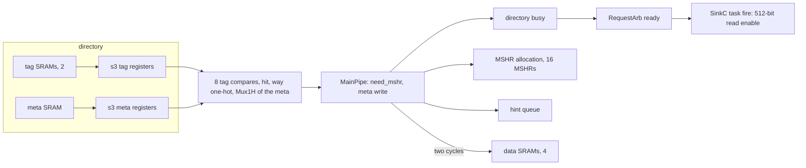

# l2_dir_hit

One cycle of an L2 cache slice's main pipeline. The directory decides
**hit** and **way** in s3, from tag and meta registers that its SRAM
macros filled the cycle before, and in the same cycle that decision
steers the slice:

- MainPipe writes the line's new meta into the directory, and the
  replacer is written on every hit. The arrays are single ported, so
  either write makes the directory unready, RequestArb withholds its ready
  from SinkC, and SinkC's task does not fire: the enable of a 512-bit
  register that reads SinkC's data buffer.
- A miss allocates one of 16 MSHRs, with the state the hit decided.
- A hit answered by MainPipe itself enqueues an L1 hint.
- The data array is read or written at the hit's way.

The design exists to measure one thing: how much of a register-to-register
path that starts beside SRAM macros, decides in one place and is
broadcast across the slice in the same cycle goes to repeaters and wire
rather than logic.

## The path

XiangShan's designers name the path in `MainPipe.scala`: "The
combinational logic path of Directory metaAll -> Directory response ->
MainPipe judging whether to respond data is too long", and latch the
SinkB response to s4 for it. The paths that remain single cycle are the
ones above.

## Where it comes from

XiangShan's L2, CoupledL2 (XSCache at 300515bc), in the configuration of
a 512 KiB, 8-way slice with a 64-byte block:

| piece | source |
|---|---|
| tag, meta arrays and the s3 hit, the single port | `coupledL2/Directory.scala:169-343, 390` |
| MainPipe's decision and its directory writes | `coupledL2/MainPipe.scala:244-262, 538-616` |
| the MSHR allocation | `coupledL2/MainPipe.scala:309, 1021-1059`, `coupledL2/MSHRCtl.scala:97-137` |
| RequestArb's ready, one task every other cycle | `coupledL2/RequestArb.scala:134-208` |
| SinkC's buffers and its read | `coupledL2/SinkC.scala:48-193` |
| the hint queue | `coupledL2/CustomL1Hint.scala:91-126` |
| the data array's request | `coupledL2/MainPipe.scala:484-519`, `coupledL2/DataStorage.scala:52-131` |

The source files cite the lines each piece models, and say what is left
out because it is not on the path.

## The two-cycle data array

XiangShan builds the data array with `readMCP2 = true`: "read data is
set MultiCycle Path 2", and the request, way, set and write data "must
hold for 2 cycles". The RTL asserts both that they hold and that no
request follows a request, and RequestArb stalls a cycle after every task
to make it so. `constraint.sdc` declares that contract, into the array
and out of it; the clock gate's enable is a one-cycle pulse and keeps one
cycle.

Without the declaration the data array's address and read data would be
among the worst paths of the design, and they would be failures the
designers never asked the flow to close.

## Configuration

| | |
|---|---|
| RTL | Readable, parameterised SystemVerilog, read by slang (`SYNTH_HDL_FRONTEND = slang`) |
| SRAMs | Behavioural modules in the firtool port convention (`RW0_*`). `AUTO_MEMORIES = 1` turns each into a generated macro at XiangShan's own shapes: two 1024x156 tag halves, a 1024x128 meta array and four 8192x137 data banks |
| Constraints | `constraint.sdc` sources `$PLATFORM_DIR/constraints.sdc`. It is a macro, so the boundaries are `set_max_delay` optimisation targets, with no `set_input_delay`/`set_output_delay`, and only reg2reg can fail. The 473 ps period is derived in the file |
| Flow | ORFS defaults throughout, all three asap7 Vt's, the full flow through final, no waivers |

## Results

The minimum clock period is the SDC period minus the worst slack of the
`reg2reg` group, at global route with the route's parasitics.

| | minimum period at grt | worst path | logic / repeaters / wire |
|---|---|---|---|
| XiangShan, CoupledL2 in XSTile | 1,128 ps | directory `req_s3_tag` to SinkC's buffer read | 341 ps (24 cells) / 473 ps (35) / 247 ps |
| this design | _pending_ | _pending_ | _pending_ |
