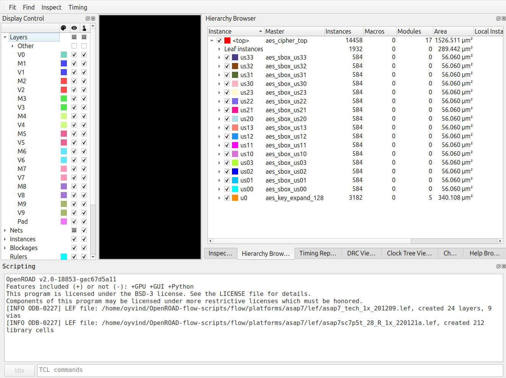
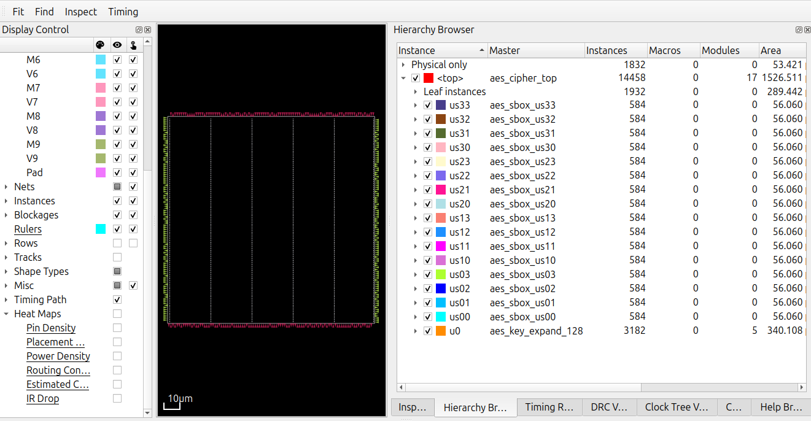
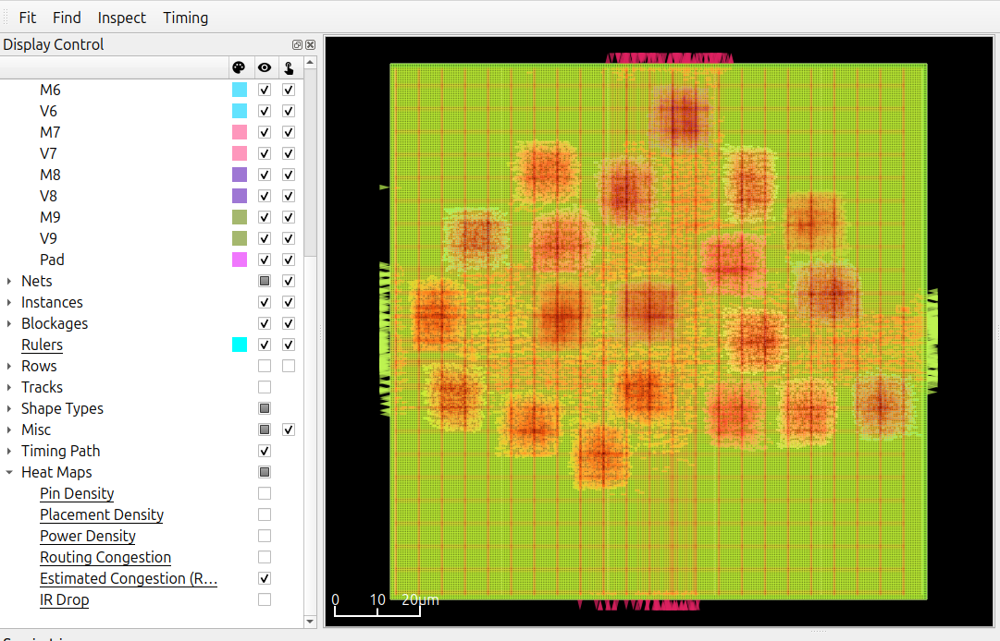
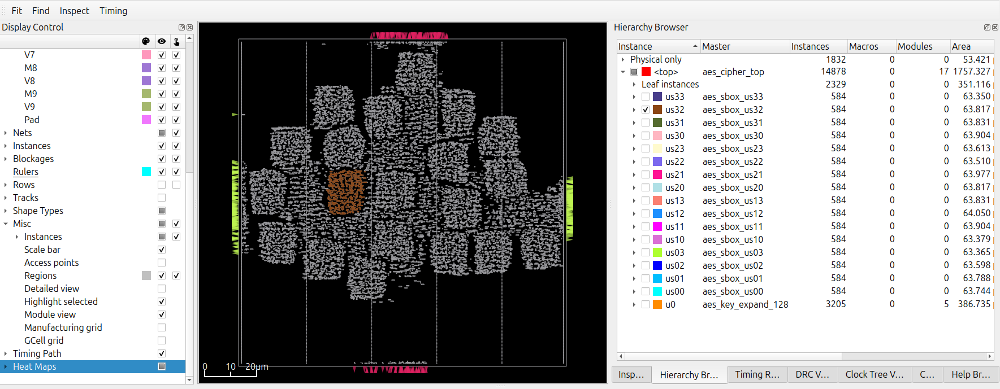
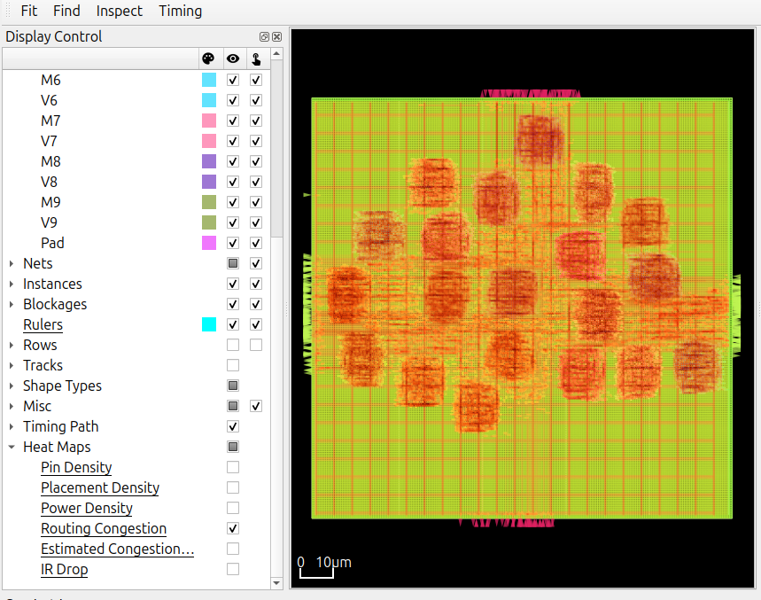

# Report on a design prior to setting up a configuration

This configuration allows running synthesis and floorplan
to extract some basic information useful when setting
up a config.mk file from scratch.

Below, instructions are given to run synthesis, floorplan, placement and
global route, then examine the results in the GUI to see what a
realistic floorplan and settings might be for your Verilog files.

The example below uses the designs/src/aes/*.v Verilog files, but
the Verilog files do not have to be located in the OpenROAD-flow-scripts
git repository, adjust the VERILOG_FILES argument to point to your Verilog
files:

1. Clean and run flow through synthesis
   ```
   make DESIGN_CONFIG=designs/asap7/minimal/config.mk DESIGN_NAME=aes_cipher_top VERILOG_FILES="$(ls designs/src/aes/*.v | xargs)" clean_all synth do-1_3_synth
   ```
2. Bring up GUI for synthesis.
   ```
   make DESIGN_CONFIG=designs/asap7/minimal/config.mk DESIGN_NAME=aes_cipher_top VERILOG_FILES="$(ls designs/src/aes/*.v | xargs)" gui_synth
   ```

Where, the exploratory config.mk file to be replaced
by a design specific config.mk file is:

```
DESIGN_CONFIG=designs/asap7/minimal/config.mk
```

Verilog files that to be investigated are specified by:

```
VERILOG_FILES="$(ls designs/src/aes/*.v | xargs)"
```

The Verilog top module name is specified by:

```
DESIGN_NAME=aes_cipher_top
```

The entire flow is cleaned and synthesis re-run by:

```
clean_all synth do-1_3_synth
```

`do-1_3_synth` is an unconditional(no dependencies) make target that converts the synthesis Verilog netlist to an .odb file so that the `gui_synth` target is available to view the synthesis result in the OpenROAD GUI. The `gui_...` targets are created dynamically based on the existence of the corresponding .odb files, which is why you can get an error message if you specify `gui_...` on a make command line when the .odb file doesn't exist, even if your command is building the .odb file.

The GUI is opened by the makefile target:

```
gui_synth
```

## `make gui_synth` OpenROAD GUI information



The module hierarchy can here be examined to give a sense of
area required for the default placement density.

## `make gui_floorplan` OpenROAD GUI information

Next to iterate on floorplan settings:

```
make DESIGN_CONFIG=designs/asap7/minimal/config.mk DESIGN_NAME=aes_cipher_top VERILOG_FILES="$(ls designs/src/aes/*.v | xargs)" clean_floorplan floorplan
```

```
make DESIGN_CONFIG=designs/asap7/minimal/config.mk DESIGN_NAME=aes_cipher_top VERILOG_FILES="$(ls designs/src/aes/*.v | xargs)" gui_floorplan
```

A few more things can be learned from looking at this minimal floorplan:

- Check that the floorplan size is not completely unreasonable and
  at least there is a chance that this design could go through
  placement with this density.



## `make gui_place` OpenROAD GUI information

Next to iterate on placement settings:

```
make DESIGN_CONFIG=designs/asap7/minimal/config.mk DESIGN_NAME=aes_cipher_top VERILOG_FILES="$(ls designs/src/aes/*.v | xargs)" clean_place place
make DESIGN_CONFIG=designs/asap7/minimal/config.mk DESIGN_NAME=aes_cipher_top VERILOG_FILES="$(ls designs/src/aes/*.v | xargs)" gui_place
```





From placement more information about how to set up the config.mk
file can be learned:

- Examine estimated routing congestion to get a sense if there
  is a chance that the design can be routed.
- Get a sense of size and location of modules
- The pins are on the edges and at least there
  is enough space on the edges to fit the top level pins

## CTS(Clock tree Synthesis)

After placement, CTS (clock tree synthesis is run). However the minimal design does not have a clock, so CTS runs quickly, but does nothing.

## `make gui_grt` OpenROAD GUI information

For non-trivial designs, some more work will need to be done in floorplan and
placement before there is a chance that global routing will complete:

```
make DESIGN_CONFIG=designs/asap7/minimal/config.mk DESIGN_NAME=aes_cipher_top VERILOG_FILES="$(ls designs/src/aes/*.v | xargs)" clean_grt grt
make DESIGN_CONFIG=designs/asap7/minimal/config.mk DESIGN_NAME=aes_cipher_top VERILOG_FILES="$(ls designs/src/aes/*.v | xargs)" gui_grt
```



Global routing congestion heatmap can be examined in the GUI.

## Next steps

Start creating a config.mk file for your design, write an .sdc file to
examine timing and find reasonable values for the CORE_UTILIZATION
and PLACE_DENSITY for your design considering routing congestion.
