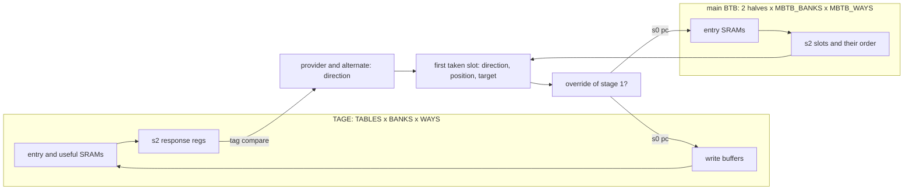
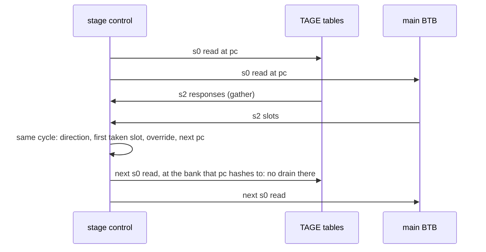

# tage_update

One cycle of a branch predictor's second stage: the TAGE's tables and
the main BTB are read from the same pc, and their responses decide the
fetch block's prediction. When that prediction overrides the first
stage's, the next fetch starts from its target, and the TAGE and main
BTB banks that pc hashes to are read again. A bank being read cannot
drain its write buffer, so the path ends at a write-buffer register
beside one table's SRAMs.

The decision logic needs both sets of SRAMs' outputs, so placement
puts it between them, and a path from one TAGE table back to a TAGE
table goes out to that logic and comes back. The design exists to
measure that detour: how far the path travels compared with the
distance between its ends, and how much of its delay is repeaters and
wire rather than logic.

## The path



The critical path starts at a stage-2 register, decides the TAGE's
direction, combines it with the main BTB's slots into the block's
prediction, compares that with the first stage's, picks the next pc,
hashes it to a bank, and ends at that bank's write buffer: the bank is
read, so it does not drain.



## Where it comes from

XiangShan's Frontend (Kunminghu), its branch predictor:
`xiangshan/frontend/bpu/Bpu.scala` for the stage-2 prediction and the
override, `bpu/tage/` for the TAGE, `bpu/mbtb/` for the main BTB and
`bpu/WriteBuffer.scala` for the write buffers. The sources cite the
lines each piece models.

The SRAMs keep XiangShan's shapes: 512x17 for the TAGE's entries
(`array_512x17`), 64x16 for its useful counters (`array_64x16`, eight
2-bit counters to a row) and 256x46 for the main BTB's entries
(`array_256x46`). All use firtool's port convention, so
`AUTO_MEMORIES` turns them into generated macros.

What is left out: the TAGE predicts one direction per fetch block
where XiangShan's predicts one per slot (wider, not deeper); the
targets' upper-bit correction; the Ftq, which in XiangShan returns a
just-predicted branch's metadata to training and here is one wire.

## Variants

| FLOW_VARIANT | TAGE | main BTB | macros |
|---|---|---|---|
| small | 2 tables, 1 bank, 1 way | 1 bank, 1 way | 6 |
| medium (= base, the default) | 4 tables, 2 banks, 2 ways | 2 banks, 2 ways | 40 |
| large | 8 tables, 4 banks, 2 ways | 4 banks, 4 ways | 160 |

large is XiangShan's size for both. base, the variant ORFS runs when
FLOW_VARIANT is not set, is the smallest that shows the effect.

## Results

The worst register-to-register path of each variant against the 473 ps
clock. The split is of the path at global route, with the clock
latencies taken out; the detour is the length of the path, cell to
cell, over the distance between its two ends.

| FLOW_VARIANT | reg2reg, grt | reg2reg, final | logic | repeaters | wire | detour | flow time |
|---|---|---|---|---|---|---|---|
| small | 470 ps | 455 ps | 409 ps, 21 cells | none | 15 ps | none | 3 min |
| medium | 534 ps | 522 ps | 414 ps, 25 cells | 52 ps, 4 cells | 18 ps | 6.2x | 10 min |
| large | 829 ps | 849 ps | 501 ps, 32 cells | 190 ps, 15 cells | 94 ps | 13.9x | 46 min |

In every variant the worst path ends at a TAGE write buffer, as
XiangShan's does. With four macros the decision logic sits next to
everything it reads and the path is logic. With 40 it already travels
six times the distance between its ends; with 160 fourteen times, and a
third of its delay is repeaters and wire. On large the main BTB's SRAMs
sit along one side of the die and the TAGE's along the other, with the
decision between them.

The same path in XiangShan's Frontend at global route (same platform,
clock and flow settings) is 1,717 ps: 537 ps of logic in 28 cells,
530 ps of repeaters in 30 and 592 ps of wire, travelling 2,730 µm
between ends 460 µm apart. The logic and the detour are the same here;
the absolute delay is not, because XiangShan's Frontend die is 955 µm
across and large's is 403 µm, the rest of the Frontend being around
the predictor. Flow time is the sum of the stages' elapsed times on one
machine.

## Constraints

`constraint.sdc` sets a 473 ps clock (see its comments for why) and
sources `$PLATFORM_DIR/constraints.sdc`: the block's ports are budgeted
with `set_max_delay`, and only register-to-register paths can fail.

## Try this

```sh
make DESIGN_CONFIG=./designs/asap7/tage_update/config.mk
make DESIGN_CONFIG=./designs/asap7/tage_update/config.mk FLOW_VARIANT=small
make DESIGN_CONFIG=./designs/asap7/tage_update/config.mk FLOW_VARIANT=large
```

Then look at the worst register-to-register path and where its cells
are:

```sh
make DESIGN_CONFIG=./designs/asap7/tage_update/config.mk gui_grt
```
