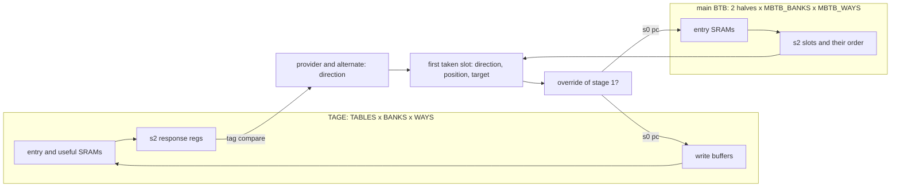
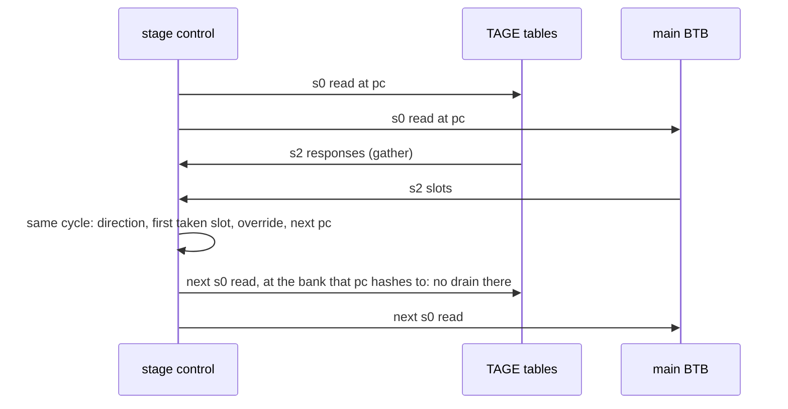

# tage_update

This design adds to the variety, relevance and fast turnaround of the
ORFS tests: generated SRAMs at scale (6 / 40 / 160 macros through
`AUTO_MEMORIES`) on ORFS's default flow settings, the structure of a
TAGE branch predictor as in XiangShan, and a size ladder whose
10-minute base variant already shows the effect.

One cycle of a branch predictor's second stage: the TAGE's tables and
the main BTB are read from the same pc, and their responses decide the
fetch block's prediction. When that prediction overrides the first
stage's, the next fetch starts from its target, and the TAGE and main
BTB banks that pc hashes to are read again, so the path ends at the
bank being read: its SRAM's read address or enable, or the write
buffer beside a TAGE table, which cannot drain while the bank is read.

The decision logic needs both sets of SRAMs' outputs, so placement
puts it between them, and a path from one TAGE table back to a TAGE
table goes out to that logic and comes back. The design exists to
measure that detour: how far the path travels compared with the
distance between its ends, and how much of its delay is repeaters and
wire rather than logic.

## The path



The critical path starts at a stage-2 register, decides the TAGE's
direction, combines it with the main BTB's slots into the block's
prediction, compares that with the first stage's, picks the next pc,
hashes it to a bank, and ends at that bank: the SRAM's read address or
enable, or the write buffer, which does not drain while the bank is
read.



## Where it comes from

XiangShan's Frontend (Kunminghu), its branch predictor:
`xiangshan/frontend/bpu/Bpu.scala` for the stage-2 prediction and the
override, `bpu/tage/` for the TAGE, `bpu/mbtb/` for the main BTB and
`bpu/WriteBuffer.scala` for the write buffers. The sources cite the
lines each piece models.

The SRAMs keep XiangShan's shapes: 512x17 for the TAGE's entries
(`array_512x17`), 64x16 for its useful counters (`array_64x16`, eight
2-bit counters to a row) and 256x46 for the main BTB's entries
(`array_256x46`). All use firtool's port convention, so
`AUTO_MEMORIES` turns them into generated macros.

What is left out: the TAGE predicts one direction per fetch block
where XiangShan's predicts one per slot (wider, not deeper); the
targets' upper-bit correction; the Ftq, which in XiangShan returns a
just-predicted branch's metadata to training and here is one wire.

## Variants

| FLOW_VARIANT | TAGE | main BTB | macros |
|---|---|---|---|
| small | 2 tables, 1 bank, 1 way | 1 bank, 1 way | 6 |
| medium (= base, the default) | 4 tables, 2 banks, 2 ways | 2 banks, 2 ways | 40 |
| large | 8 tables, 4 banks, 2 ways | 4 banks, 4 ways | 160 |

large is XiangShan's size for both. base, the variant ORFS runs when
FLOW_VARIANT is not set, is the smallest that shows the effect.

## What it shows

The worst path in every variant leaves stage 2's pc and ends at an
SRAM's read address or enable: the override has decided where the next
fetch starts, and the banks that pc hashes to have to be read. The
decision needs both the TAGE's and the main BTB's outputs, so it sits
between the two groups of SRAMs, and the path back from it to a bank
grows with the field of SRAMs around it.

- small is logic. The decision sits next to everything it reads, and
  repeaters and wire are a small part of the path.
- medium starts to travel: a few repeaters appear, and the path is
  longer than the distance between its ends.
- large is the size of XiangShan's predictor. The main BTB's SRAMs sit
  along one side of the die and the TAGE's along the other, the path is
  about a millimetre long, and close to half of its delay is repeaters
  and wire. That half is what this design is for.

Two things decide how much of that half is paid:

- The metal stack. With resistance-aware global routing (asap7's
  default) the critical nets go to M8 and M9, which this design routes
  to, as XiangShan does.
- Detailed routing. It makes the long nets longer than global route
  estimated, so large is worse at final than at global route.

A change to the flow for this class of path shows on large as a shorter
path or a smaller repeater and wire share. Look at the worst path after
global route:

```sh
make DESIGN_CONFIG=./designs/asap7/tage_update/config.mk FLOW_VARIANT=large gui_grt
```

XiangShan's Frontend has the same structure on a die 2.4 times wider,
the rest of the Frontend surrounding the predictor, so the effect is
larger there.

## Constraints

`constraint.sdc` sets a 473 ps clock (see its comments for why) and
sources `$PLATFORM_DIR/constraints.sdc`: the block's ports are budgeted
with `set_max_delay`, and only register-to-register paths can fail.

## Try this

```sh
make DESIGN_CONFIG=./designs/asap7/tage_update/config.mk
make DESIGN_CONFIG=./designs/asap7/tage_update/config.mk FLOW_VARIANT=small
make DESIGN_CONFIG=./designs/asap7/tage_update/config.mk FLOW_VARIANT=large
```

Then look at the worst register-to-register path and where its cells
are:

```sh
make DESIGN_CONFIG=./designs/asap7/tage_update/config.mk gui_grt
```
