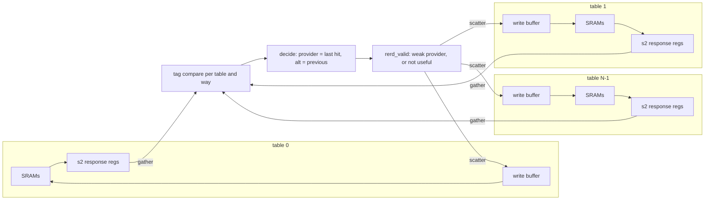
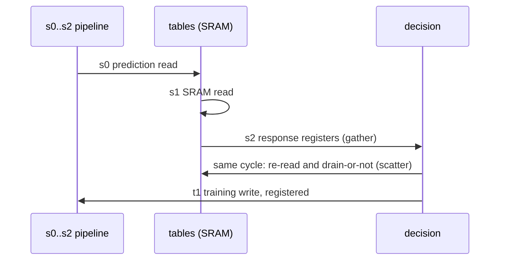

# tage_update

One cycle of a TAGE branch predictor's training: every table's read
response is **gathered** to the middle, a provider is **decided**, and
the decision is **scattered** back to one bank of every table. Each
table is a set of SRAM macros, so the cycle starts and ends at macro
pins spread over the die.

The design exists to measure one thing: how much of a register-to-register
path that spans distributed macros goes to repeaters and wire rather
than logic, and how that share grows with the number of tables.

## The path



The critical path starts at a stage-2 response register in one table,
passes the tag comparison, the provider priority chain and the re-read
condition, and ends at a write-buffer head register in every table:
a bank that is re-read this cycle cannot drain its write buffer.



## Where it comes from

XiangShan's Frontend (Kunminghu), the branch predictor's TAGE:
`xiangshan/frontend/bpu/tage/Tage.scala` and `TageTable.scala`. The
source files cite the lines each piece models. In XiangShan the
decision reaches training through the Ftq, which returns a
just-predicted branch's metadata; here that round trip is one wire,
so the cycle is the same and nothing else is.

On XiangShan's Frontend this class of path, at global route on asap7
with timing-driven placement and three threshold voltages, has about as
many buffers as logic cells, and the distance its cells cover is about
six times the distance between its two ends.

The SRAMs keep XiangShan's shapes: 512x17 for the entries
(`array_512x17`) and 64x16 for the useful counters (`array_64x16`,
eight 2-bit counters to a row). Both use firtool's port convention, so
`AUTO_MEMORIES` turns them into generated macros.

## Variants

The parameters are the number of tables, banks per table and ways per
bank; each (table, bank, way) is one entry SRAM and one useful SRAM.

| FLOW_VARIANT | TABLES | BANKS | WAYS | macros |
|---|---|---|---|---|
| small | 2 | 1 | 1 | 4 |
| medium | 4 | 2 | 2 | 32 |
| large (= base, the default) | 8 | 4 | 2 | 128 |

base, the variant ORFS runs when FLOW_VARIANT is not set, is the
smallest rung that shows the effect.

## Results

The worst register-to-register path of each variant, at global route
and at final, against the 473 ps clock. The split is of the path at
global route, with the clock latencies taken out: clock-to-q and setup
are the rest.

| FLOW_VARIANT | reg2reg, grt | reg2reg, final | logic | repeaters | wire | flow time |
|---|---|---|---|---|---|---|
| small | 396 ps | 380 ps | 338 ps, 14 cells | none | 12 ps | 2 min |
| medium | 466 ps | 458 ps | 393 ps, 17 cells | none | 17 ps | 5 min |
| large | 486 ps | 481 ps | 288 ps, 20 cells | 121 ps, 10 cells | 20 ps | 18 min |

In every variant the path is the one this design is about: from a
stage-2 pc register, through the decision, to a write-buffer register
of one table. Up to 32 macros it is logic. At 128, the size of
XiangShan's TAGE, the tables are far enough apart that repeaters and
wire are 29 % of it, with one repeater for every two logic cells; on
XiangShan's Frontend the same path has about as many repeaters as logic
cells. Flow time is the sum of the stages' elapsed times on one machine.

## Constraints

`constraint.sdc` sets a 473 ps clock (see its comments for why) and
sources `$PLATFORM_DIR/constraints.sdc`: the block's ports are budgeted
with `set_max_delay`, and only register-to-register paths can fail.

## Try this

```sh
make DESIGN_CONFIG=./designs/asap7/tage_update/config.mk
make DESIGN_CONFIG=./designs/asap7/tage_update/config.mk FLOW_VARIANT=small
make DESIGN_CONFIG=./designs/asap7/tage_update/config.mk FLOW_VARIANT=medium
```

Then compare the worst register-to-register path across the variants:

```sh
make DESIGN_CONFIG=./designs/asap7/tage_update/config.mk gui_grt
```
