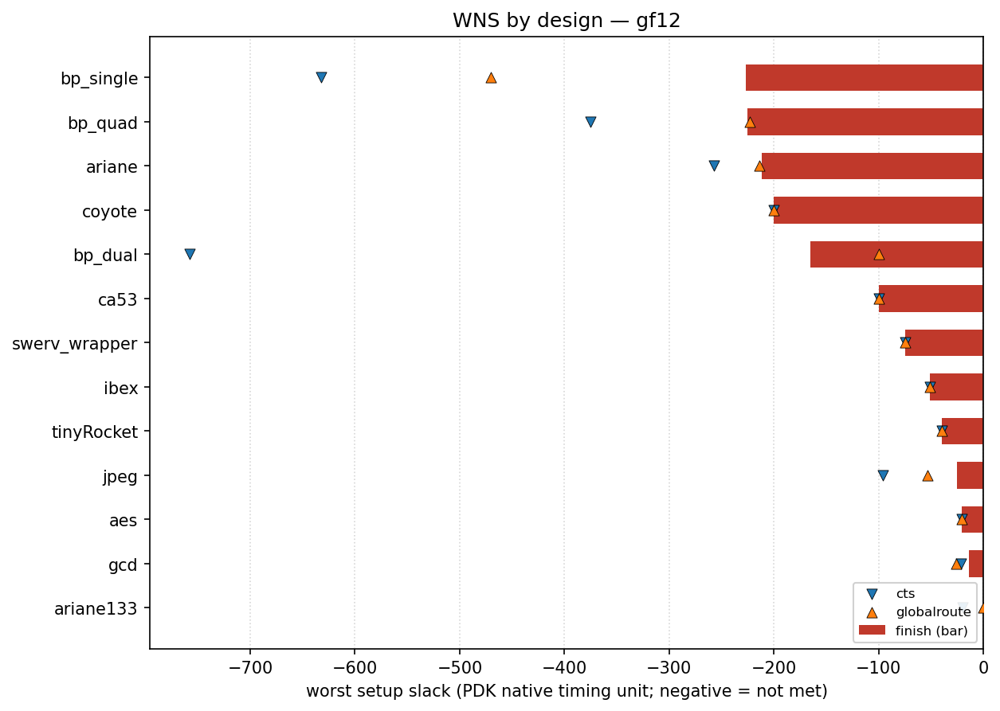

# gf12 designs

<!-- BEGIN WNS (generated by flow/util/plot_wns.py) -->
## WNS

Worst setup slack per design at three flow stages — clock-tree synthesis (`cts`), global route (`globalroute`) and `finish` — read from each design's `rules-base.json`. Negative means setup timing is not met. Values are in this PDK's native timing unit (ps for `asap7`, ns for most others), so they are comparable within this PDK but not across PDKs.

The bar is the `finish` slack; the markers show the `cts` and `globalroute` slack for the same design, so stage-to-stage movement is visible.

| design | cts | globalroute | finish |
| --- | ---: | ---: | ---: |
| bp_single | -632 | -470 | -227 |
| bp_quad | -375 | -223 | -225 |
| ariane | -257 | -214 | -212 |
| coyote | -200 | -200 | -200 |
| bp_dual | -758 | -100 | -165 |
| ca53 | -100 | -100 | -100 |
| swerv_wrapper | -75 | -75 | -75 |
| ibex | -51 | -51 | -51 |
| tinyRocket | -40 | -40 | -40 |
| jpeg | -96 | -53.2 | -25 |
| aes | -21 | -21 | -21 |
| gcd | -21.5 | -26.3 | -14 |
| ariane133 | -20.2409 | 0 | 0 |

_Generated by `flow/util/plot_wns.py` from `rules-base.json`; regenerate with `python3 flow/util/plot_wns.py`._
<!-- END WNS -->
