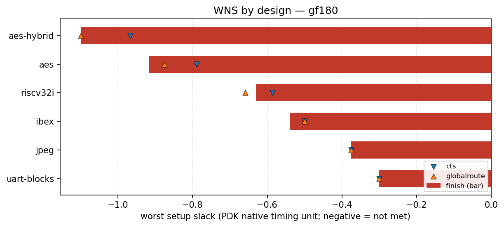

# gf180 designs

<!-- BEGIN WNS (generated by flow/util/plot_wns.py) -->
## WNS

Worst setup slack per design at three flow stages — clock-tree synthesis (`cts`), global route (`globalroute`) and `finish` — read from each design's `rules-base.json`. Negative means setup timing is not met. Values are in this PDK's native timing unit (ps for `asap7`, ns for most others), so they are comparable within this PDK but not across PDKs.

The bar is the `finish` slack; the markers show the `cts` and `globalroute` slack for the same design, so stage-to-stage movement is visible.

| design | cts | globalroute | finish |
| --- | ---: | ---: | ---: |
| aes-hybrid | -0.967 | -1.1 | -1.1 |
| aes | -0.789 | -0.876 | -0.918 |
| riscv32i | -0.586 | -0.659 | -0.63 |
| ibex | -0.5 | -0.5 | -0.539 |
| jpeg | -0.375 | -0.375 | -0.375 |
| uart-blocks | -0.3 | -0.3 | -0.3 |

_Generated by `flow/util/plot_wns.py` from `rules-base.json`; regenerate with `python3 flow/util/plot_wns.py`._
<!-- END WNS -->
