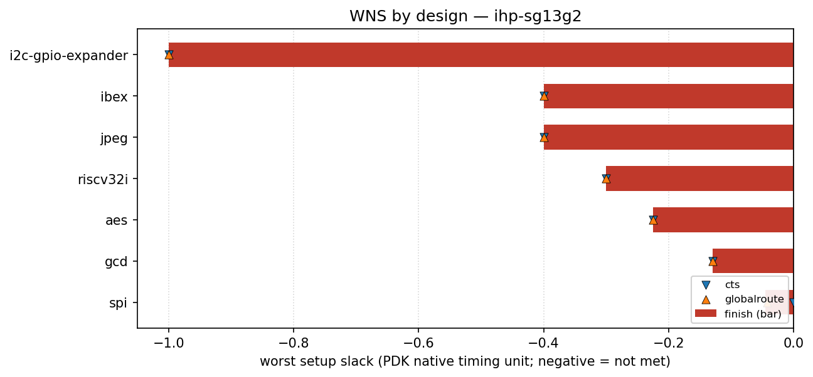

# ihp-sg13g2 designs

<!-- BEGIN WNS (generated by flow/util/plot_wns.py) -->
## WNS

Worst setup slack per design at three flow stages — clock-tree synthesis (`cts`), global route (`globalroute`) and `finish` — read from each design's `rules-base.json`. Negative means setup timing is not met. Values are in this PDK's native timing unit (ps for `asap7`, ns for most others), so they are comparable within this PDK but not across PDKs.

The bar is the `finish` slack; the markers show the `cts` and `globalroute` slack for the same design, so stage-to-stage movement is visible.

| design | cts | globalroute | finish |
| --- | ---: | ---: | ---: |
| i2c-gpio-expander | -1 | -1 | -1 |
| ibex | -0.4 | -0.4 | -0.4 |
| jpeg | -0.4 | -0.4 | -0.4 |
| riscv32i | -0.3 | -0.3 | -0.3 |
| aes | -0.225 | -0.225 | -0.225 |
| gcd | -0.13 | -0.13 | -0.13 |
| spi | 0 | -0.0426 | -0.045 |

_Generated by `flow/util/plot_wns.py` from `rules-base.json`; regenerate with `python3 flow/util/plot_wns.py`._
<!-- END WNS -->
