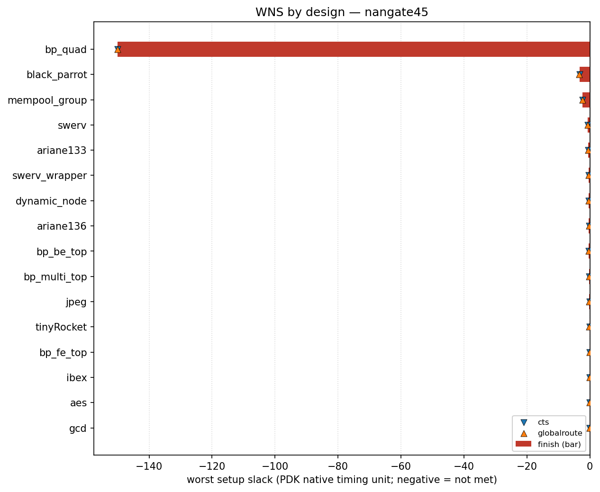

# nangate45 designs

<!-- BEGIN WNS (generated by flow/util/plot_wns.py) -->
## WNS

Worst setup slack per design at three flow stages — clock-tree synthesis (`cts`), global route (`globalroute`) and `finish` — read from each design's `rules-base.json`. Negative means setup timing is not met. Values are in this PDK's native timing unit (ps for `asap7`, ns for most others), so they are comparable within this PDK but not across PDKs.

The bar is the `finish` slack; the markers show the `cts` and `globalroute` slack for the same design, so stage-to-stage movement is visible.

| design | cts | globalroute | finish |
| --- | ---: | ---: | ---: |
| bp_quad | -150 | -150 | -150 |
| black_parrot | -3.31 | -3.45 | -3.26 |
| mempool_group | -2.31 | -2.31 | -2.31 |
| swerv | -0.671 | -0.719 | -0.677 |
| ariane133 | -0.579 | -0.569 | -0.595 |
| swerv_wrapper | -0.344 | -0.357 | -0.35 |
| dynamic_node | -0.362 | -0.38 | -0.344 |
| ariane136 | -0.3 | -0.3 | -0.318 |
| bp_be_top | -0.331 | -0.315 | -0.318 |
| bp_multi_top | -0.24 | -0.24 | -0.24 |
| jpeg | -0.147 | -0.165 | -0.164 |
| tinyRocket | -0.14 | -0.168 | -0.154 |
| bp_fe_top | -0.09 | -0.09 | -0.131 |
| ibex | -0.11 | -0.127 | -0.11 |
| aes | -0.041 | -0.0692 | -0.0667 |
| gcd | -0.0529 | -0.0657 | -0.0559 |

_Generated by `flow/util/plot_wns.py` from `rules-base.json`; regenerate with `python3 flow/util/plot_wns.py`._
<!-- END WNS -->
