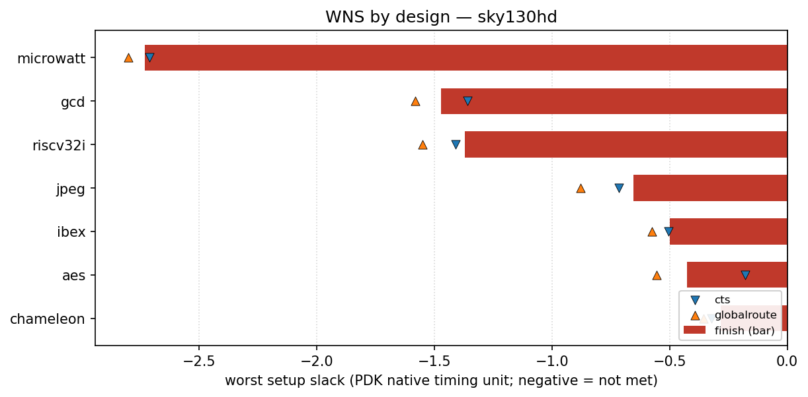

# sky130hd designs

<!-- BEGIN WNS (generated by flow/util/plot_wns.py) -->
## WNS

Worst setup slack per design at three flow stages — clock-tree synthesis (`cts`), global route (`globalroute`) and `finish` — read from each design's `rules-base.json`. Negative means setup timing is not met. Values are in this PDK's native timing unit (ps for `asap7`, ns for most others), so they are comparable within this PDK but not across PDKs.

The bar is the `finish` slack; the markers show the `cts` and `globalroute` slack for the same design, so stage-to-stage movement is visible.

| design | cts | globalroute | finish |
| --- | ---: | ---: | ---: |
| microwatt | -2.71 | -2.8 | -2.73 |
| gcd | -1.36 | -1.58 | -1.47 |
| riscv32i | -1.41 | -1.55 | -1.37 |
| jpeg | -0.716 | -0.877 | -0.654 |
| ibex | -0.505 | -0.576 | -0.5 |
| aes | -0.18 | -0.554 | -0.425 |
| chameleon | -0.321 | -0.356 | -0.282 |

_Generated by `flow/util/plot_wns.py` from `rules-base.json`; regenerate with `python3 flow/util/plot_wns.py`._
<!-- END WNS -->
