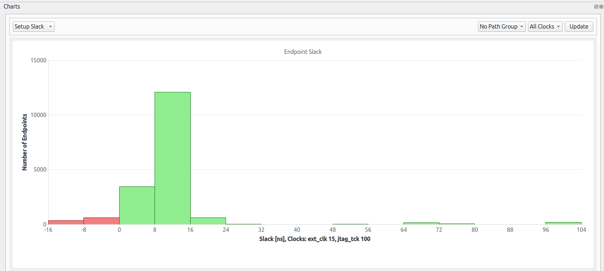
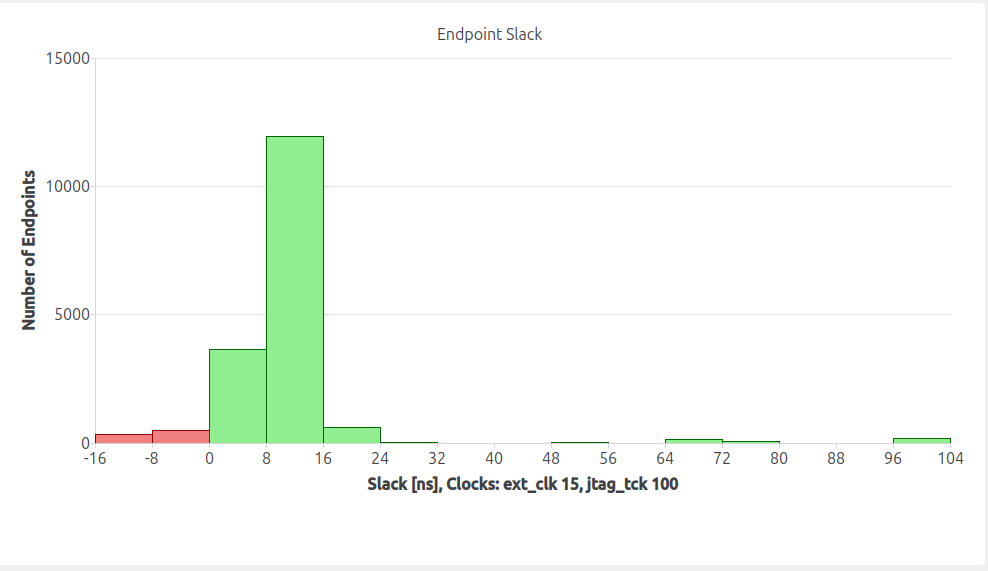
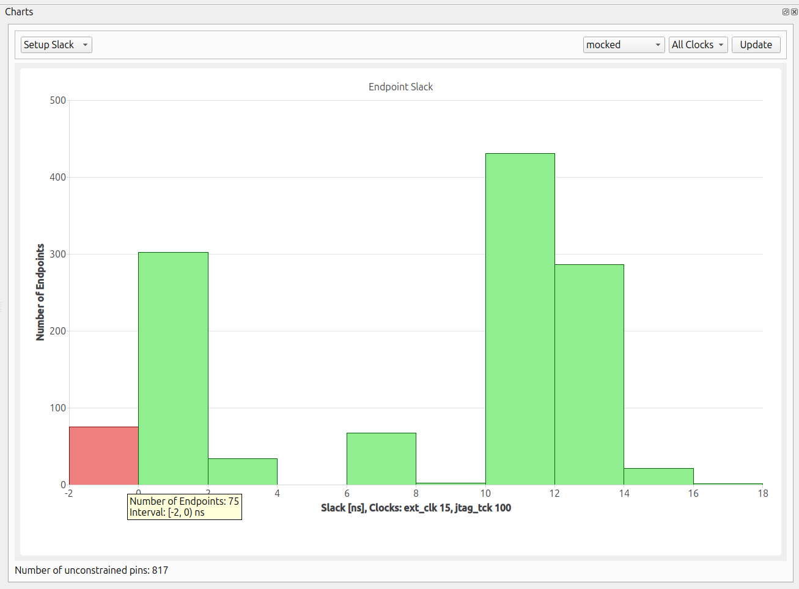

# Mocking vs fake memories

Configuring fake memories for this design would speed up the ORFS flow and increase accuracy of results, but some effort is required. Two methods for learning something about a design without setting up SRAM are explained here.

## Synthesis with large flip flop memories

By default `SYNTH_MEMORY_MAX_BITS=42000` since no fake memories have been configured for this example design. This is simple, but results in slow builds and unrealistically large amount of flip flops and singificantly slower timing than fakeram or real RAMs.



## Results with `SYNTH_MOCK_LARGE_MEMORIES=1`

To ensure a quick synthesis run and to better understand the design without being slowed down by large memory blocks, we set a `SYNTH_MEMORY_MAX_BITS=1024`. This helps us bypass potential memory-related issues and focus on other ORFS flow issues of the design.

During synthesis, certain modules are reported in error messages when `SYNTH_MEMORY_MAX_BITS=1024` and `SYNTH_MOCK_LARGE_MEMORIES=0`. By explicitly listing these modules in `SYNTH_KEEP_MODULES`, we avoid further optimizations outside of the mocked memories that could obscure the behavior of the rest of the design.

The goal of these settings is to enable a rapid exploration of the flow, providing insights into the design while minimizing complications from large memory structures.



## Other ways to speed up synthesis

There is a small advantage in synthesis time for `SYNTH_MOCK_LARGE_MEMORIES=1`, it shaves off ca. 1 minute on a 3 minute build on a test on a laptop. However, larger designs can have synthesis run into hours if memories are not managed with a bit of care.

For synthesis, yosys-abc actually takes most of the time and SRAMs don't generally change in a design, even if other RTL development continues. It is possible to keep the synthesized netlist for SRAMs list them in `SYNTH_BLACKBOXES` and simply concatenate the already built netlists onto the `1_synth.v` files before continuing the flow.

If large modules that change rarely are kept in a large design and only a small part of the design changes during RTL development, then it is possible to set up a build flow that completes in minutes instead of hours.

## A/B run times

The difference in run-times for mocking and simply instantiating larger flip flop based RAMs is not large on this design, but on designs with bigger SRAMs, the difference can be substantial.

    make DESIGN_CONFIG=designs/sky130hd/microwatt/config.mk SYNTH_MOCK_LARGE_MEMORIES=1 FLOW_VARIANT=mock
    make DESIGN_CONFIG=designs/sky130hd/microwatt/config.mk

| Step                      | Mock RAM/s | Default/s |
|---------------------------|------------|-----------|
| 1_1_yosys_canonicalize    | 4          | 4         |
| 1_2_yosys                 | 161        | 182       |
| 1_3_synth                 |            | 1         |
| 2_1_floorplan             | 72         | 83        |
| 2_2_floorplan_macro       | 16         | 16        |
| 2_3_floorplan_tapcell     | 1          | 0         |
| 2_4_floorplan_pdn         | 7          | 9         |
| 3_1_place_gp_skip_io      | 43         | 45        |
| 3_2_place_iop             | 1          | 1         |
| 3_3_place_gp              | 331        | 327       |
| 3_4_place_resized         | 68         | 65        |
| 3_5_place_dp              | 79         | 74        |
| 4_1_cts                   | 152        | 180       |
| 5_1_grt                   | 385        | 404       |
| 5_2_route                 | 3827       | 3960      |

## `SYNTH_MOCK_LARGE_MEMORIES=1` worst ext_clk path

```
Startpoint: soc0/processor/icache_0/rams:1.way/cache_ram_0
            (rising edge-triggered flip-flop clocked by ext_clk)
Endpoint: soc0/processor/icache_0/_163_[147]$_DFFE_PP_
          (rising edge-triggered flip-flop clocked by ext_clk)
Path Group: ext_clk
Path Type: max

  Delay    Time   Description
---------------------------------------------------------
   0.00    0.00   clock ext_clk (rise edge)
   4.07    4.07   clock network delay (propagated)
   0.00    4.07 ^ soc0/processor/icache_0/rams:1.way/cache_ram_0/CLK (RAM32_1RW1R)
  11.44   15.51 v soc0/processor/icache_0/rams:1.way/cache_ram_0/Do1[31] (RAM32_1RW1R)
   0.62   16.14 v soc0/processor/icache_0/rams:1.way/_43_/X (sky130_fd_sc_hd__mux2_4)
   0.42   16.56 v soc0/processor/icache_0/_2550_/X (sky130_fd_sc_hd__mux2_4)
   0.19   16.75 v place24125/X (sky130_fd_sc_hd__buf_12)
   0.15   16.90 v soc0/processor/decode1_0/_2318_/Y (sky130_fd_sc_hd__nand2b_4)
   0.38   17.27 v soc0/processor/decode1_0/_2375_/X (sky130_fd_sc_hd__or3_4)
   0.14   17.41 ^ soc0/processor/decode1_0/_2737_/Y (sky130_fd_sc_hd__nor2_4)
   0.07   17.48 v soc0/processor/decode1_0/_2738_/Y (sky130_fd_sc_hd__inv_2)
   0.19   17.67 ^ soc0/processor/decode1_0/_2740_/Y (sky130_fd_sc_hd__a21oi_4)
   0.24   17.91 v soc0/processor/decode1_0/_3744_/Y (sky130_fd_sc_hd__nand4b_1)
   0.16   18.06 ^ soc0/processor/decode1_0/_4248_/Y (sky130_fd_sc_hd__nand2b_1)
   0.16   18.22 ^ soc0/processor/_318_/X (sky130_fd_sc_hd__or2_4)
   0.05   18.27 v soc0/processor/icache_0/_2130_/Y (sky130_fd_sc_hd__nor2_4)
   0.09   18.36 ^ soc0/processor/icache_0/_2131_/Y (sky130_fd_sc_hd__nand2_4)
   0.05   18.41 v soc0/processor/icache_0/_2132_/Y (sky130_fd_sc_hd__a211oi_4)
   0.19   18.60 v rebuffer29423/X (sky130_fd_sc_hd__buf_12)
   0.11   18.72 ^ soc0/processor/icache_0/_2133_/Y (sky130_fd_sc_hd__nand2_8)
   0.06   18.78 v soc0/processor/icache_0/_2155_/Y (sky130_fd_sc_hd__inv_12)
   0.14   18.92 v place19388/X (sky130_fd_sc_hd__buf_12)
   0.14   19.06 v place19392/X (sky130_fd_sc_hd__buf_12)
   0.14   19.19 v place19394/X (sky130_fd_sc_hd__buf_12)
   0.16   19.35 v soc0/processor/icache_0/_2494_/X (sky130_fd_sc_hd__and2_4)
   0.00   19.35 v soc0/processor/icache_0/_163_[147]$_DFFE_PP_/D (sky130_fd_sc_hd__edfxtp_1)
          19.35   data arrival time

  15.00   15.00   clock ext_clk (rise edge)
   3.42   18.42   clock network delay (propagated)
  -0.25   18.17   clock uncertainty
   0.14   18.31   clock reconvergence pessimism
          18.31 ^ soc0/processor/icache_0/_163_[147]$_DFFE_PP_/CLK (sky130_fd_sc_hd__edfxtp_1)
  -0.24   18.07   library setup time
          18.07   data required time
---------------------------------------------------------
          18.07   data required time
         -19.35   data arrival time
---------------------------------------------------------
          -1.27   slack (VIOLATED)
```

## `SYNTH_MOCK_LARGE_MEMORIES=0` worst ext_clk path

As can be seen, there's no significant difference in the worst negative slack path for ext_clk.

```
Startpoint: soc0/processor/icache_0/rams:1.way/cache_ram_0
            (rising edge-triggered flip-flop clocked by ext_clk)
Endpoint: soc0/processor/icache_0/_163_[14]$_SDFFE_PP0P_
          (rising edge-triggered flip-flop clocked by ext_clk)
Path Group: ext_clk
Path Type: max

  Delay    Time   Description
---------------------------------------------------------
   0.00    0.00   clock ext_clk (rise edge)
   4.04    4.04   clock network delay (propagated)
   0.00    4.04 ^ soc0/processor/icache_0/rams:1.way/cache_ram_0/CLK (RAM32_1RW1R)
  11.44   15.48 v soc0/processor/icache_0/rams:1.way/cache_ram_0/Do1[59] (RAM32_1RW1R)
   0.64   16.12 v soc0/processor/icache_0/rams:1.way/_76_/X (sky130_fd_sc_hd__mux2_4)
   0.36   16.48 v soc0/processor/icache_0/_2544_/X (sky130_fd_sc_hd__mux2_4)
   0.15   16.64 v place27067/X (sky130_fd_sc_hd__buf_6)
   0.06   16.70 ^ soc0/processor/decode1_0/_3560_/Y (sky130_fd_sc_hd__inv_4)
   0.16   16.85 ^ soc0/processor/decode1_0/_6875_/COUT (sky130_fd_sc_hd__ha_4)
   0.07   16.92 v soc0/processor/decode1_0/_3695_/Y (sky130_fd_sc_hd__nand2b_4)
   0.39   17.31 ^ soc0/processor/decode1_0/_3696_/Y (sky130_fd_sc_hd__nor3_4)
   0.20   17.51 ^ place24130/X (sky130_fd_sc_hd__buf_6)
   0.06   17.57 v soc0/processor/decode1_0/_5317_/Y (sky130_fd_sc_hd__nand2_4)
   0.30   17.87 ^ soc0/processor/decode1_0/_5318_/Y (sky130_fd_sc_hd__a21oi_4)
   0.19   18.06 ^ place23148/X (sky130_fd_sc_hd__buf_6)
   0.22   18.28 v soc0/processor/decode1_0/_6350_/Y (sky130_fd_sc_hd__nand4b_1)
   0.29   18.57 v place22875/X (sky130_fd_sc_hd__buf_6)
   0.10   18.67 ^ soc0/processor/decode1_0/_6854_/Y (sky130_fd_sc_hd__nand2b_4)
   0.15   18.82 ^ soc0/processor/_318_/X (sky130_fd_sc_hd__or2_4)
   0.12   18.94 ^ place22433/X (sky130_fd_sc_hd__buf_12)
   0.05   18.99 v soc0/processor/icache_0/_2130_/Y (sky130_fd_sc_hd__nor2_4)
   0.16   19.15 v place22148/X (sky130_fd_sc_hd__buf_6)
   0.08   19.23 ^ soc0/processor/icache_0/_2131_/Y (sky130_fd_sc_hd__nand2_4)
   0.07   19.30 v soc0/processor/icache_0/_2132_/Y (sky130_fd_sc_hd__a211oi_4)
   0.18   19.48 v place21617/X (sky130_fd_sc_hd__buf_12)
   0.11   19.59 ^ soc0/processor/icache_0/_2133_/Y (sky130_fd_sc_hd__nand2_8)
   0.06   19.65 v soc0/processor/icache_0/_2155_/Y (sky130_fd_sc_hd__inv_8)
   0.15   19.80 v place21391/X (sky130_fd_sc_hd__buf_12)
   0.13   19.93 v place21403/X (sky130_fd_sc_hd__buf_12)
   0.14   20.07 v rebuffer32771/X (sky130_fd_sc_hd__buf_4)
   0.19   20.26 ^ soc0/processor/icache_0/_2285_/Y (sky130_fd_sc_hd__mux2i_1)
   0.15   20.40 ^ place21348/X (sky130_fd_sc_hd__buf_4)
   0.04   20.44 v soc0/processor/icache_0/_2286_/Y (sky130_fd_sc_hd__nor2_1)
   0.00   20.44 v soc0/processor/icache_0/_163_[14]$_SDFFE_PP0P_/D (sky130_fd_sc_hd__dfxtp_1)
          20.44   data arrival time

  15.00   15.00   clock ext_clk (rise edge)
   3.53   18.53   clock network delay (propagated)
  -0.25   18.28   clock uncertainty
   0.14   18.42   clock reconvergence pessimism
          18.42 ^ soc0/processor/icache_0/_163_[14]$_SDFFE_PP0P_/CLK (sky130_fd_sc_hd__dfxtp_1)
  -0.11   18.31   library setup time
          18.31   data required time
---------------------------------------------------------
          18.31   data required time
         -20.44   data arrival time
---------------------------------------------------------
          -2.13   slack (VIOLATED)
```

## Histogram of mocked memories

It can be useful to look at the Endpoint Slack Histogram of mocked memories to examine if some of the paths are overly optimistic with a single row mocked memory or if the paths through the memory has problems even with a single row memory:

Create a path group for the memories in question:

    group_path -through *decode1_0* -name mocked

Now that path group is in the dropdown in the Endpoint Slack Histogram:



## Conclusion

Above there's no visible difference in the Endpoint Slack histogram for the two approaches. In other words, the design doesn't appear to be terribly sensitive to how RAMs are mocked, other factors dominate and merit further investigation.

ORFS is built on `make`, which shines for simple, fast flows. For larger, complicated, designs and with flows that take a long time to run, it is worth looking beyond `make` to [bazel-orfs](https://github.com/The-OpenROAD-Project/bazel-orfs)


