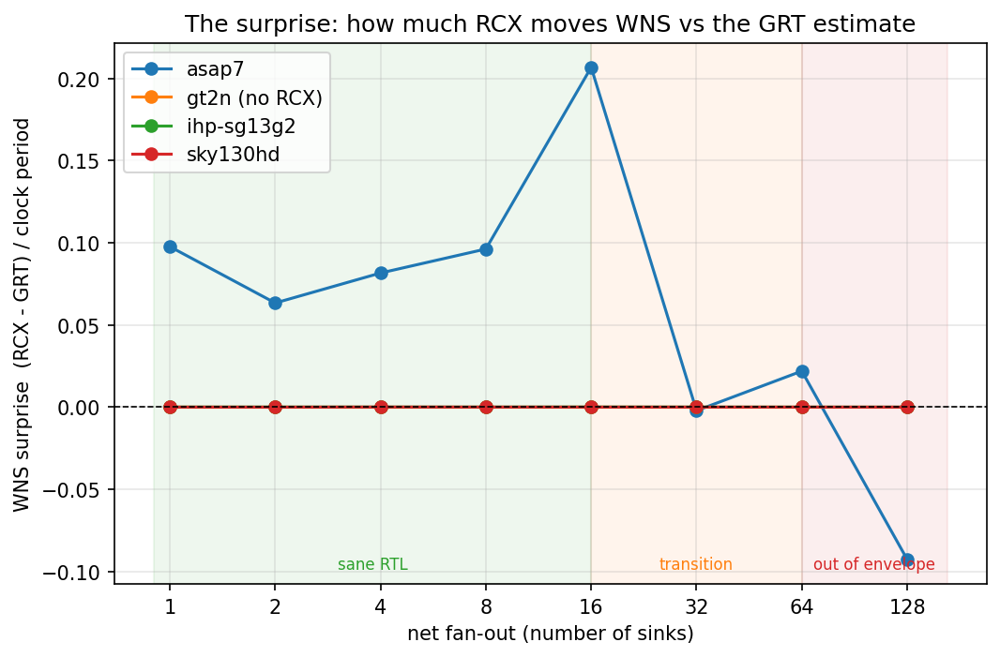
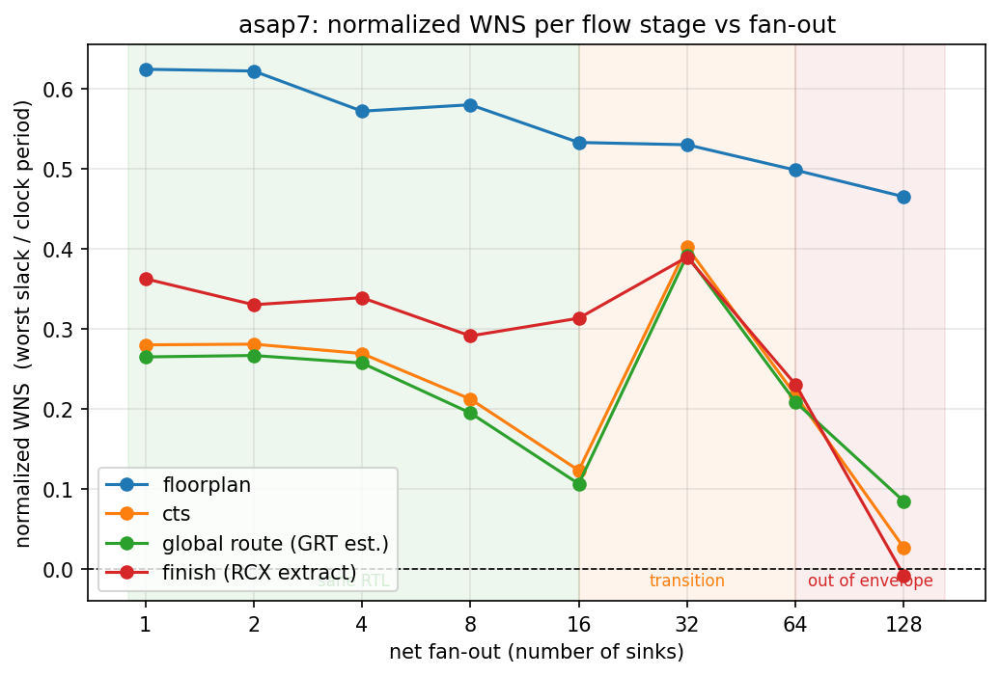
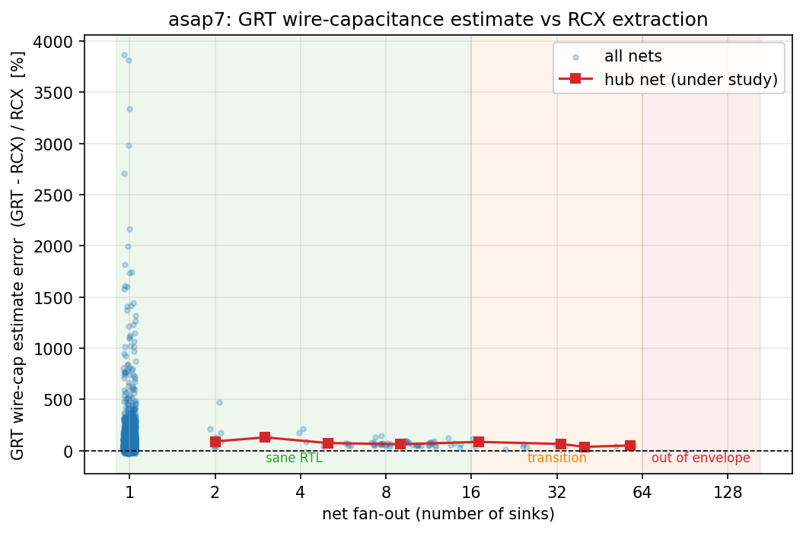

# Disappointment is just mismanaged expectations

### What to expect when global-route WNS meets RCX sign-off

This is a small, self-contained study (synthetic designs + a few scripts) that
measures **how far the global-route (GRT) timing estimate is from the
post-route OpenRCX sign-off**, as a function of net fan-out and wire length,
across PDKs. It exists so that nobody is *surprised* when the WNS they read at
global route is not the WNS they get at `finish`. The gap is real, it is
predictable, and — as the plots below show — it can be large enough to flip a
design from "closes" to "fails" and back.

> TL;DR: ORFS computes timing three times with three different parasitic models
> — `set_wire_rc` at placement, per-layer `set_layer_rc` after global route, and
> OpenRCX extraction at `finish`. The first two are *estimates*; only the last
> is *extracted* from the routed geometry. For long / high-fan-out nets the
> estimate and the extraction diverge. Today nothing in the flow warns you which
> nets are responsible. This study quantifies the divergence and proposes that
> global route flag the offending nets.

## The three parasitic models (why there is a gap at all)

OpenROAD does not have one parasitic model, it has three, applied at three
points in the flow ([OpenROAD discussion #3943][3943]):

| Stage | Parasitics | Command | Accuracy |
|-------|-----------|---------|----------|
| placement | one default layer's R/C × estimated wire length | `set_wire_rc` | roughest |
| global route | per-layer R/C × global-route wire length | `set_layer_rc` (`estimate_parasitics -global_routing`) | better topology, still lumped, **coupling-blind** |
| finish | extracted from detailed-routed geometry | OpenRCX `extract_parasitics -ext_model_file $RCX_RULES` | sign-off |

The resizer README states the limitation plainly:

> *"Placement-based parasitics cannot accurately predict routed parasitics, so a
> margin can be used to 'over-repair' the design to compensate."* — [rsz README][rsz]

The per-layer `set_layer_rc` values that drive the global-route estimate are a
**single linear model per layer**: capacitance ≈ (per-layer C) × (wire length).
That model:

- ignores **coupling capacitance** to neighbours (which dominates at advanced
  nodes and depends on routing that does not exist yet at global route);
- is only as good as the per-layer constants in the platform's `setRC.tcl`,
  which are hand-derived and **not systematically validated against the RCX
  deck** by the platform bring-up procedure ([PlatformBringUp][bringup]);
- "gives us an average over different contexts, but also 'hides' differences in
  topology and layer assignment which may lead to inconsistencies"
  ([ORFS issue #3969][3969]).

ORFS ships a tool, `flow/util/correlateRC.py` (`make correlate_rc`), that fits
those per-layer constants to RCX and plots the residual GRT-vs-RCX gap. It is an
**offline, whole-PDK calibration step**. There is **no in-flow, per-design check
that the specific nets you just built fall inside the envelope where that linear
model is trustworthy.** That missing check is the feature this study argues for.

## The experiment

Synthetic, deliberately minimal designs (`docs/rcx/gen_study.py`): a single
launch flop (the *hub*) drives one net that fans out to **N** capture flops.
Inputs are pinned to the **west** edge, outputs to the **east** edge, so the
fan-out net spans the die. The hub is `dont_touch`, so the resizer cannot clone
the driver and chop the net into short, well-estimated segments — the long net
stays long, which is the whole point. We sweep **N = 1, 2, 4, 8, 16, 32, 64,
128**, well past the "sane RTL" fan-out region, and read WNS at every flow stage
plus the per-net GRT and RCX parasitics (`make write_net_rc`).

WNS is **normalized by the clock period** so the *shape* of the curves is
comparable across PDKs (we do not care about absolute MHz here, only how far the
estimate strays from sign-off).

### The "sane RTL" region

The shaded bands on every plot mark where the estimate is expected to hold:

- **green, fan-out ≤ 16** — at/under the logical-effort FO4 sweet spot and the
  usual `set_max_fanout` floor; the Steiner topology (FLUTE) is accurate to
  ~0.07% wire-length error, so the estimate should track RCX;
- **amber, 16–64** — the resizer starts inserting buffer trees; coupling and
  detour error grow;
- **red, > 64** — multi-level buffering is mandatory and many-sink nets'
  half-perimeter wire length under-estimates badly.

Fan-out is a *proxy* for the real driver (long, coupling-heavy nets); the study
also varies wire length directly (see below).

## Results

Plots and `plots/study_data.csv` are generated by `bazelisk run
//flow/docs/rcx:update` (or `python3 docs/rcx/plot_rcx_study.py`) and committed,
so they render in GitHub's static Markdown.

**The headline.** On asap7, the fan-out-128 design **closes at global route and
fails at sign-off**: GRT reports WNS ≈ **+21 ps** (looks fine), RCX reports WNS
≈ **−2 ps** (does not meet timing). The estimate is also *pessimistic* at low
fan-out (e.g. fan-out 16: GRT under-reports slack by ~50 ps). So the GRT WNS is
not a conservative bound — it is wrong in *both* directions depending on the net.



The "surprise" — how far RCX moves WNS from the GRT estimate, as a fraction of
the clock period — is **substantial on asap7 (7 nm)** and swings sign with
fan-out, but is **flat at ~0 on sky130hd and ihp-sg13g2 (130 nm)**: at the older
node the lumped per-layer estimate tracks extraction to a fraction of a
picosecond. **gt2n (2 nm) ships no OpenRCX deck at all**, so `finish` *is* the
GRT estimate — there is nothing to diverge from, and no extraction-based
sign-off exists. The divergence is an **advanced-node phenomenon**, exactly
where it hurts most.



Per net, the GRT capacitance estimate is off by tens of percent even where WNS
looks healthy — the errors partially cancel along a path, which is precisely why
the WNS number *hides* them:



The actionable per-net report (`docs/rcx/rcx_divergence_report.py`) ranks the
nets whose GRT estimate is furthest from RCX (net name, fan-out, routed length,
GRT vs RCX cap, % error, verdict) — the report this study argues global route
should emit natively.

## Can we tune the estimate to match? Is this a bug?

Largely **no, and no** — it is a known *calibration limitation*, not a defect:

- The per-layer `set_layer_rc` model is intentionally coarse; improving it is
  tracked as an enhancement ([ORFS #3969][3969], the motivation for
  `correlateRC.py`'s `--mode segment`).
- Idiomatic levers exist but are blunt: re-derive `setRC.tcl` per corner from
  the RCX deck with `make correlate_rc`; toggle `ENABLE_RESISTANCE_AWARE`;
  apply `repair_design -cap_margin/-slew_margin` to "over-repair". None of these
  tell you *which net in your design* is mis-estimated.
- OpenRCX itself is calibrated against a golden field solver
  ([calibration][rcxcal]); the GRT *estimate* is not calibrated per design.

## Feature request (the point of filing this)

Global route already owns a DRC-marker database (`dbMarkerCategory "Global
route"`) and already attaches the offending nets to its **congestion** markers.
We ask for that same, already-built machinery to also surface parasitic
estimation risk:

1. **A per-net GRT-vs-RCX divergence report** (or an `estimate_parasitics`
   mode that emits per-net estimated R/C next to the routed extraction), so the
   gap is queryable instead of requiring two SPEF dumps + `diff_spef`.
2. **A new global-route DRC-marker subcategory, "parasitic estimation out of
   range,"** that `addSource()`s the nets whose fan-out / Steiner length / layer
   span put them outside the envelope where `set_layer_rc`'s linear model is
   trustworthy — so they light up in the DRC viewer exactly like congestion
   markers do, including for *non-failing* designs.
3. **A warning + RTL guidance** when such nets exist ("net X: fan-out N, length
   L µm — estimate may diverge from extraction; consider splitting the net,
   pipelining, or an explicit fan-out buffer stage").

This turns a silent, end-of-flow surprise into an early, actionable signal.

## Reproduce

```bash
# 1. generate the synthetic designs (all PDKs)
python3 flow/docs/rcx/gen_study.py
# 2. run the full flow + collect per-stage WNS and per-net RC for a PDK
flow/docs/rcx/run_study.sh asap7          # then sky130hd, ihp-sg13g2, gt2n
# 3. (re)generate the plots + data table
python3 flow/docs/rcx/plot_rcx_study.py   # or: bazelisk run //flow/docs/rcx:update
# 4. actionable per-net report for one design
python3 flow/docs/rcx/rcx_divergence_report.py \
    results/asap7/rcx-fanout-128/base/6_net_rc.csv
```

Note: **gt2n ships no OpenRCX deck**, so its `finish` stage falls back to the
global-route estimate — there is no extraction sign-off to diverge from. It is
included as an estimate-only data point, and that absence is itself a finding:
at 2 nm in ORFS today there is no extraction-based timing sign-off at all.

[3943]: https://github.com/The-OpenROAD-Project/OpenROAD/discussions/3943
[3969]: https://github.com/The-OpenROAD-Project/OpenROAD-flow-scripts/issues/3969
[rsz]: https://github.com/The-OpenROAD-Project/OpenROAD/blob/master/src/rsz/README.md
[bringup]: https://openroad-flow-scripts.readthedocs.io/en/latest/contrib/PlatformBringUp.html
[rcxcal]: https://openroad.readthedocs.io/en/latest/main/src/rcx/doc/calibration.html

### References

- I. Sutherland, R. Sproull, D. Harris, *Logical Effort: Designing Fast CMOS
  Circuits*, Morgan Kaufmann, 1999. (FO4 / `set_max_fanout`.)
- C. Chu, Y.-C. Wong, "FLUTE: Fast Lookup Table Based Rectilinear Steiner
  Minimal Tree Algorithm," ICCAD 2004 / IEEE TCAD 2008. (Steiner WL accuracy.)
- Liu et al., "Bridging the Gap between Global Route and Detailed Route ... for
  Wire Parasitics and Delay Prediction," arXiv:2305.06917, 2023.
- L. Clark et al., "ASAP7: A 7-nm finFET predictive PDK," Microelectronics
  Journal, 2016.
